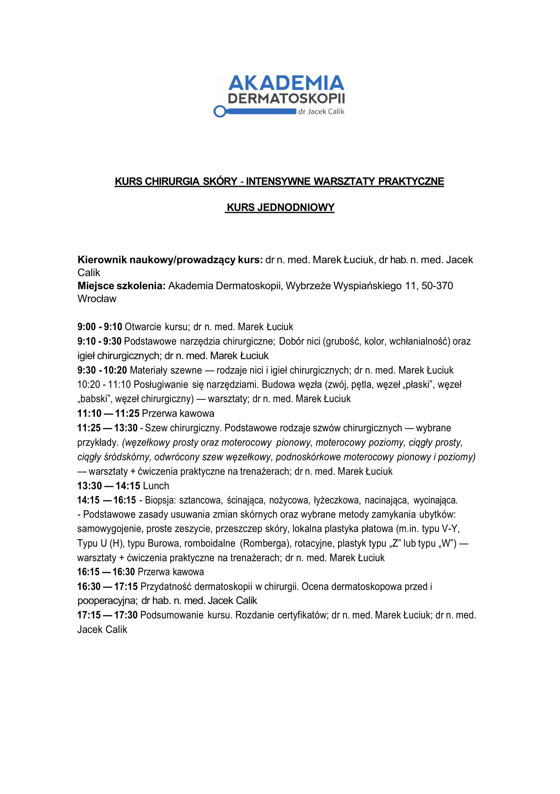

## Opis

Jednodniowy kurs o w pełni praktycznym charakterze, oparty na wieloletnim doświadczeniu
szkoleniowym. Od pierwszej godziny uczestnicy pracują manualnie — najpierw na **trenażerach**,
następnie na **preparatach zwierzęcych** (świńskie nogi), co pozwala bezpiecznie i realistycznie
opanować techniki zabiegowe.

## Program

Kurs przygotowuje do samodzielnego wykonywania prostych procedur chirurgicznych w obrębie skóry.
Program obejmuje m.in. techniki szycia, podstawowe plastyki płatowe oraz zasady prawidłowego
opracowania rany.

## Dermatoskopia w planowaniu zabiegu

Zajęcia prowadzone są przez **doświadczonego chirurga oraz onkologa-dermatoskopistę** — dzięki temu
poza techniką operacyjną nauczysz się także wykorzystywać dermatoskopię w planowaniu zabiegów oraz
monitorowaniu procesu gojenia. Będziesz również dokładnie wiedział, jakie marginesy trzeba zachować
w poszczególnych typach nowotworów oraz jak poprowadzić cięcie do usunięcia zmiany, aby było
poprawne onkologicznie.

<callout variant="warning" title="Limit 10 osób">
  Kurs prowadzony w bardzo małych grupach — gwarantuje to indywidualny feedback. Zapisy są
  **limitowane** i regularnie wyprzedają się z wyprzedzeniem.
</callout>

## Agenda

