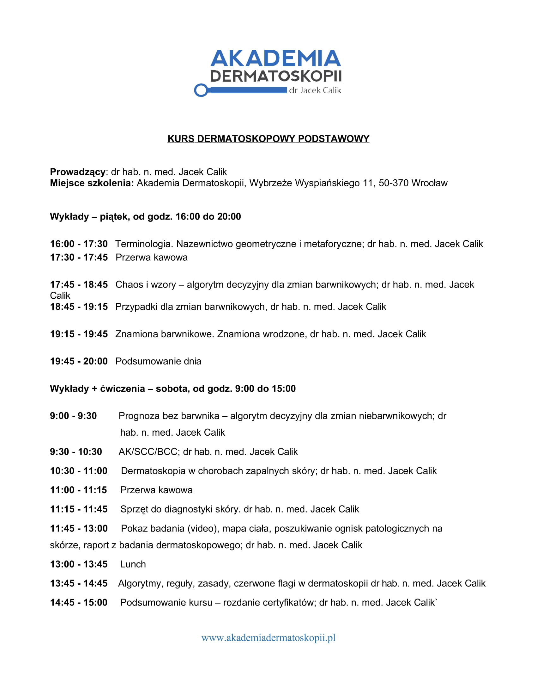

## Opis

Dwudniowy, intensywnie praktyczny kurs dermatoskopii dla lekarzy. Poznasz pełne spektrum wzorów
dermatoskopowych oraz kluczowe algorytmy diagnostyczne, w tym **regułę chaosu i wzorów** oraz
prognozowanie bez obecności barwnika.

Skupiamy się na różnicowaniu **zmian melanocytarnych** (znamiona vs. czerniak) oraz **guzów
keratynocytowych** (rak podstawnokomórkowy, rak kolczystokomórkowy), a także stanów
przednowotworowych — rogowacenia słonecznego i choroby Bowena. Omówimy również obraz dermatoskopowy
najczęstszych zmian łagodnych, takich jak naczyniaki, brodawki łojotokowe czy włókniaki twarde.

## Praktyka od pierwszej godziny

Teoria jest stale przeplatana praktyką — pracujesz na **ponad 10 modelach dermatoskopów ręcznych**
oraz na wideodermatoskopach firm **Canfield** i **FotoFinder**.

## Efekt kursu

Po kursie jesteś w stanie rozpoznać **95% zmian**, które oglądasz u pacjenta na skórze.

<callout variant="note">
  **Nie wymagamy wcześniejszego doświadczenia z dermatoskopią.** Kurs prowadzony jest od podstaw.
</callout>

## Agenda

