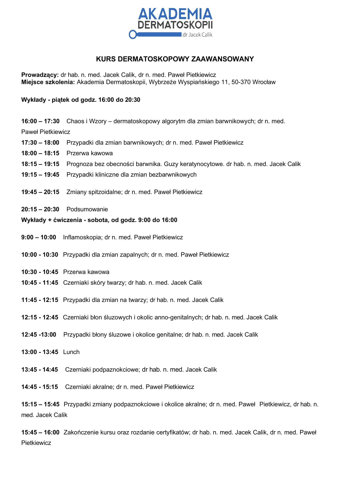

## Opis

Zaawansowany, dwudniowy kurs dermatoskopii dla lekarzy z podstawowym doświadczeniem. Zajęcia
prowadzone są przez **dwóch specjalistów — dermatologa i onkologa** — co zapewnia szeroką
perspektywę kliniczną i onkologiczną.

## Program

Program rozpoczyna się **pogłębioną analizą najczęściej stosowanych algorytmów diagnostycznych**,
wykraczającą poza poziom kursu podstawowego. Następnie skupiamy się na dermatoskopii zmian zapalnych
oraz na szczegółowej ocenie zmian w **lokalizacjach trudnych**: twarz, aparat paznokciowy, okolice
akralne, błony śluzowe i okolice anogenitalne.

## Charakter zajęć

Kurs ma charakter intensywnie praktyczny — kładziemy nacisk na interpretację rzeczywistych obrazów
i podejmowanie decyzji diagnostycznych w złożonych przypadkach.

## Agenda

