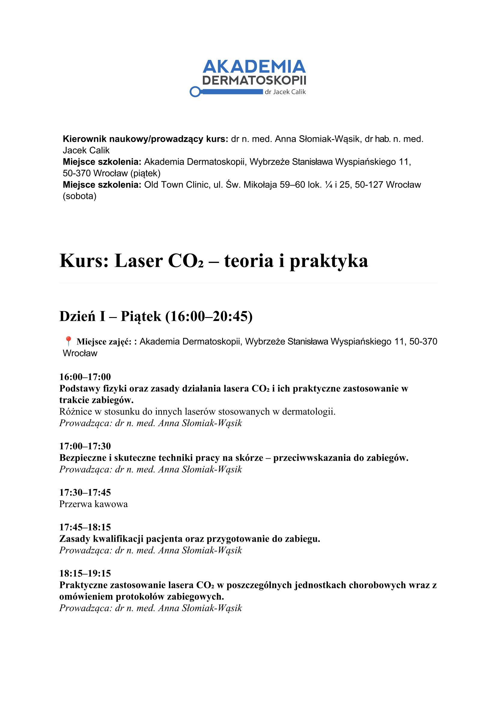

## Dlaczego laser CO2

Laser CO2 to wszechstronne narzędzie w dermatologii i medycynie estetycznej. Dwudniowy kurs daje
pełne przygotowanie do samodzielnej pracy — od podstaw fizyki przez kwalifikację pacjenta po
praktyczne zabiegi i postępowanie z powikłaniami.

## Program

### Dzień 1 — teoria i wskazania

- Fizyka lasera CO2 — tryb ciągły, pulsacyjny, ultrapulsacyjny
- Oddziaływanie z tkanką: ablacja, koagulacja, fotomodulacja
- Wskazania: zmiany łagodne, zmarszczki, blizny, fotostarzenie
- Przeciwwskazania bezwzględne i względne
- Zasady bezpieczeństwa laserowego (BHP)

### Dzień 2 — praktyka

- Zabiegi ablacji zmian łagodnych (włókniaki, rogowacenia, brodawki)
- Fractional resurfacing — parametry i technika
- Postępowanie pozabiegowe
- Powikłania — diagnostyka i leczenie
- Każdy uczestnik wykonuje zabiegi pod nadzorem

<callout variant="note" title="Nowość 2026">
  Kurs dołącza do programu Akademii w 2026 roku. Pierwsza edycja odbywa się w czerwcu.
</callout>

## Agenda

