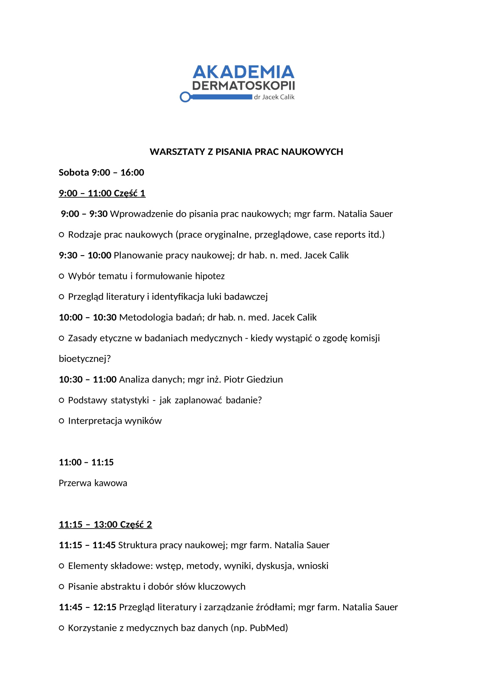
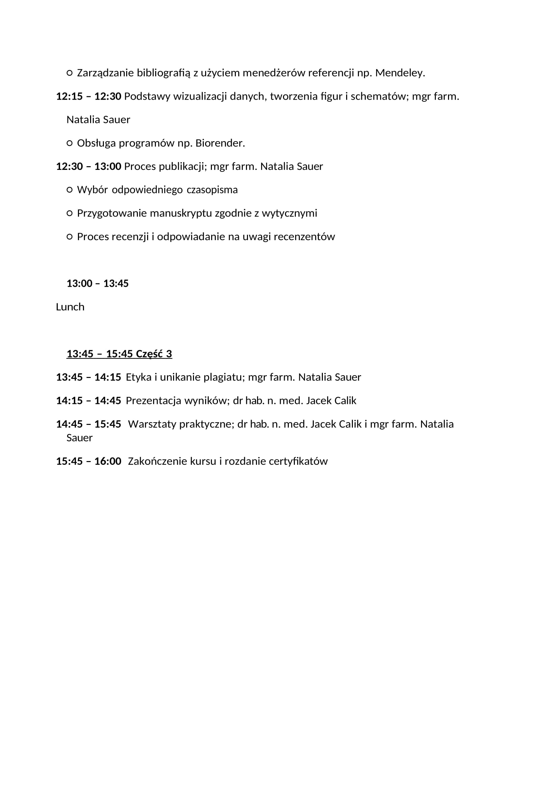

## Opis

Jednodniowy kurs prowadzony przez naukowców: **lekarza, farmaceutę i statystyka** — zespół z bogatym
doświadczeniem w projektowaniu badań oraz publikowaniu prac naukowych o różnym profilu.

## Program

Program obejmuje cały cykl powstawania publikacji: od wyboru tematu i zaprojektowania badania,
przez analizę statystyczną, po przygotowanie manuskryptu i skuteczne przejście procesu wydawniczego.
Pokazujemy, jak efektywnie wykorzystywać nowoczesne narzędzia wspierające pisanie, w tym
rozwiązania oparte na **AI**.

## Strategia publikacyjna

Po kursie będziesz wiedzieć, jak rozpocząć i prowadzić projekty naukowe w kontekście **ścieżki
doktorskiej lub habilitacyjnej**. Otrzymasz również praktyczne wskazówki, jak publikować
strategicznie — dobierać czasopisma, zwiększać szanse akceptacji oraz optymalizować dorobek pod
kątem prestiżu, **Impact Factor** i punktacji ministerialnej.

<callout variant="note" title="Wersja rozszerzona">
  Dostępna jest również dwudniowa wersja kursu **zakończona przygotowaniem własnego manuskryptu**
  z opisem przypadku do publikacji.
</callout>

## Agenda

