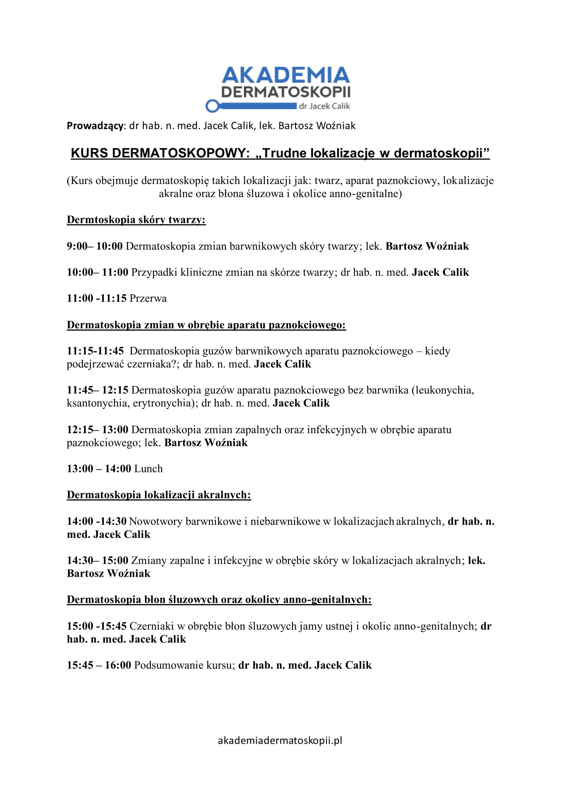

## Opis

Dwudniowy, specjalistyczny kurs „Trudne lokalizacje w dermatoskopii", prowadzony przez **dermatologa
i onkologa**. Program skierowany jest do lekarzy, którzy na co dzień pracują z dermatoskopią i chcą
pogłębić kompetencje w wymagających obszarach diagnostycznych.

## Program

Szczegółowo analizujemy dermatoskopowy obraz zmian **nowotworowych, zapalnych i infekcyjnych**
w lokalizacjach trudnych: twarz, aparat paznokciowy, okolice akralne, błony śluzowe oraz okolice
anogenitalne. Kurs dostarcza aktualnej, opartej na najnowszych doniesieniach wiedzy dotyczącej
wzorów dermatoskopowych, „czerwonych flag" oraz pułapek diagnostycznych charakterystycznych dla
tych obszarów.

## Charakter zajęć

Zajęcia mają wyraźnie praktyczny charakter — nacisk kładziemy na interpretację obrazów,
różnicowanie zmian i podejmowanie trafnych decyzji klinicznych w codziennej praktyce.

## Agenda

