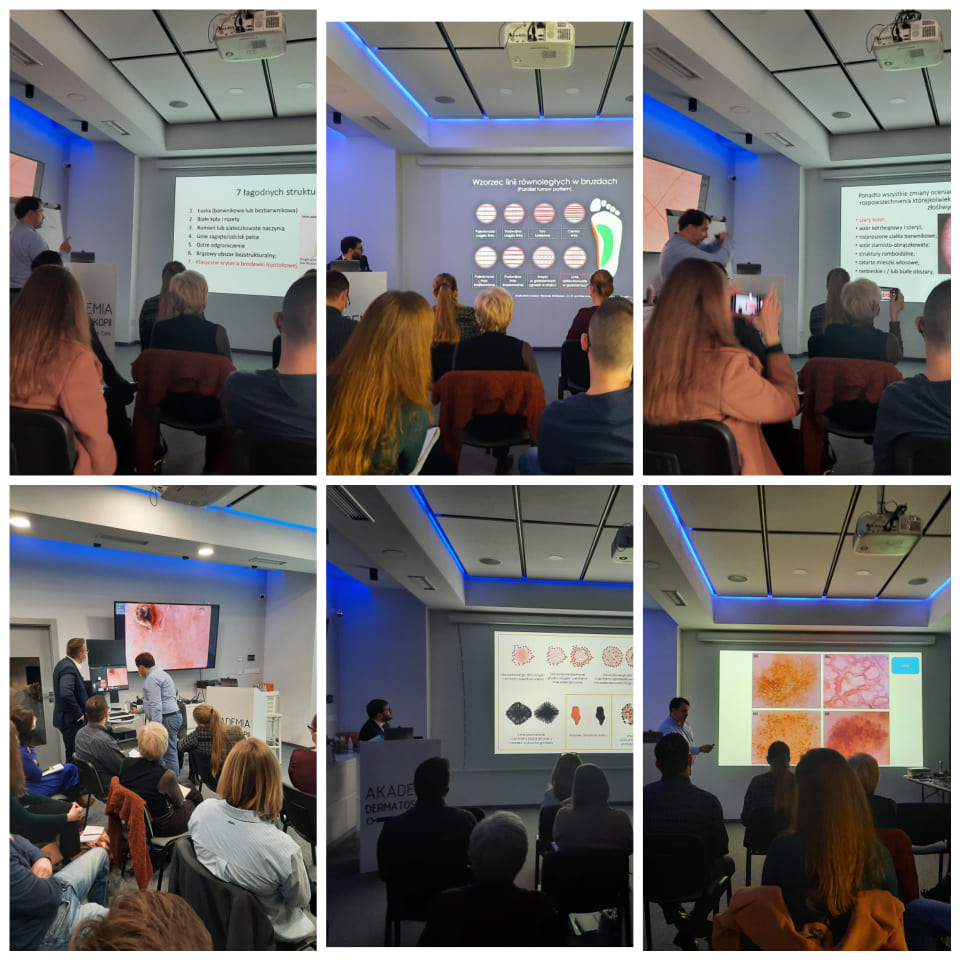

Kilka godzin temu zakończył się kolejny i zarazem ostatni już w tym roku kurs dermatoskopowy na poziomie zaawansowanym! Kierownikiem naukowym i prowadzącym kurs niezmiennie byli dr n. med. Jacek Calik oraz dr n. med. Paweł Pietkiewicz. Podczas kursu dzięki uprzejmości firmy Bechtold & co mieliśmy do dyspozycji wideodermatoskop Canfield d200 do mapowania skóry oraz dermatoskopy ręczne Dermlie i Illuco, a dzięki uprzejmości firmy Plus Ultra wszystkie dermatoskopy ręczne firmy Heine. Podczas kursu zaawanswanego nie mogło zabraknąć USG do skóry DermaScan firmy Cortex, umożliwiające określenie głębokości zmiany. Dziękujemy uczestniczacym w kursie lekarzom za zaangażowanie, żywą dyskusję i chęć nauki.

Już wkrótce podamy terminy kursów na 2022 rok!!!

-   
