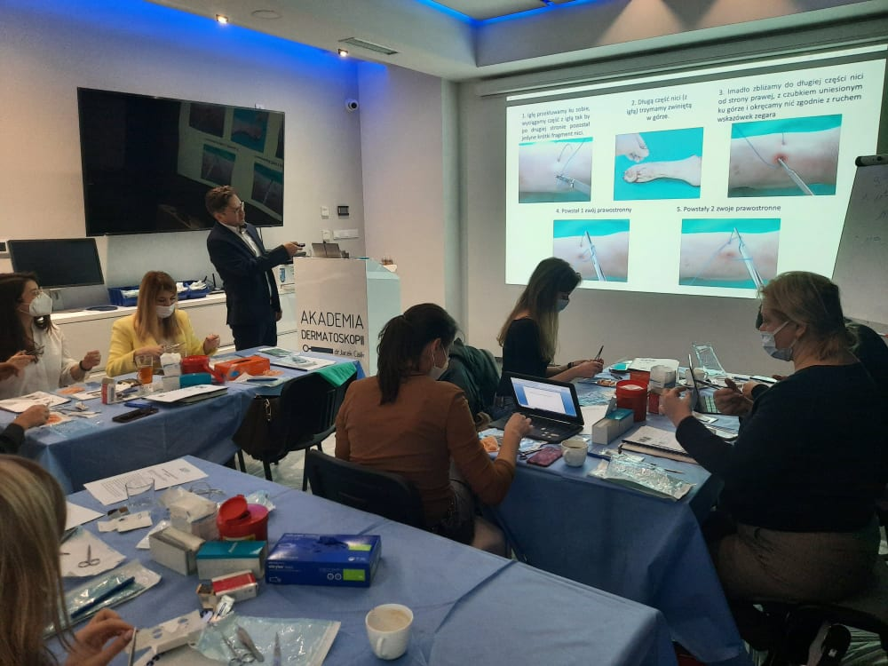
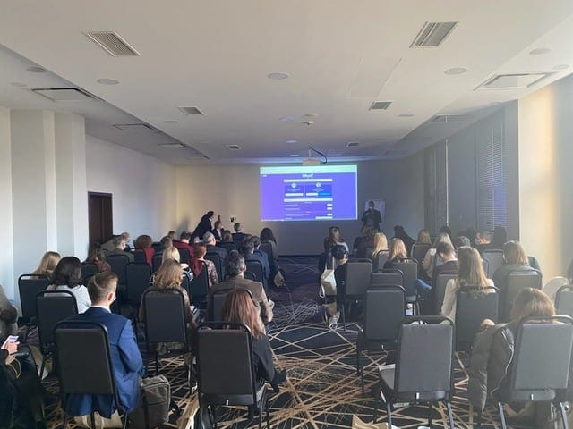

Dziś w Akademii Dermatoskopii podwójna aktywność! W Łodzi podczas spotkania założycielskiego Polska Grupa Dermatoskopowa – Polish Dermatoscopy Group z wykładem wystąpi dr n. med. Jacek Calik przybliżając temat „BRAAFF checklist – algorytm dla barwnikowych zmian akralnych”. Jednocześnie od samego rana we Wrocławiu trwa pierwszy w tym roku intensywny kurs praktyczny z Chirurgii skóry, który prowadzi dr n. med. Marek Łuciuk!

-   
    
-   
