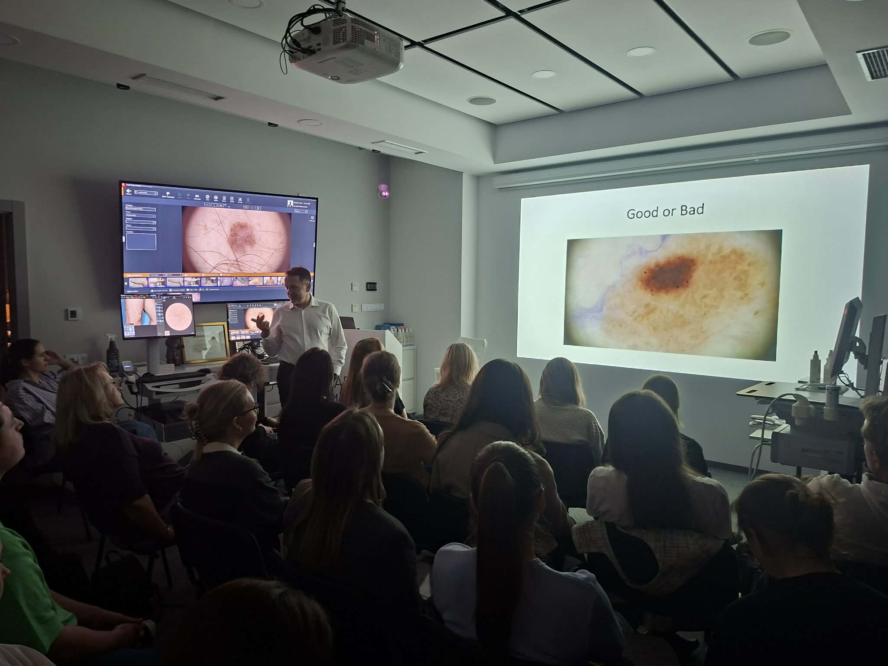
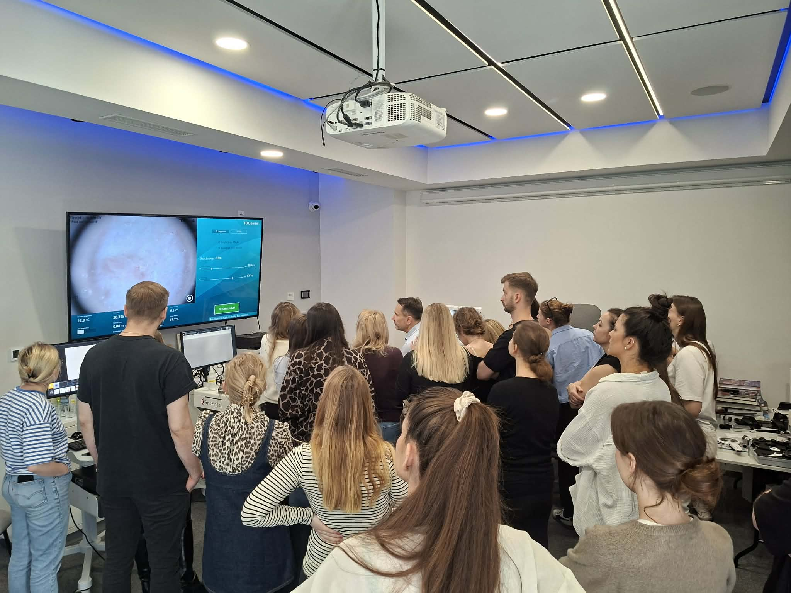
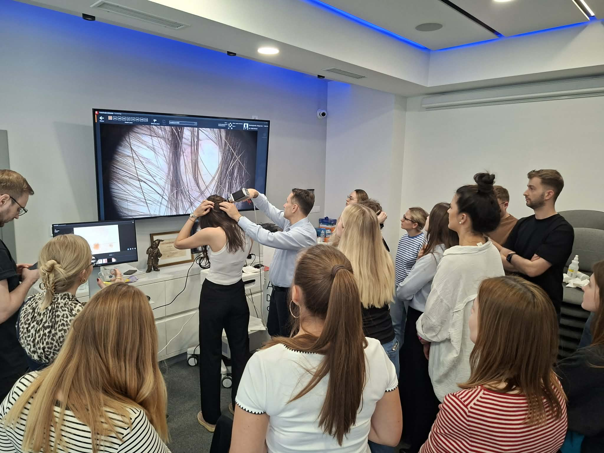

Akademia Dermatoskopii nie zwalnia tempa!  
Piątek i sobota były pełne nauki, a to wszystko za sprawą kursu dermatoskopowego na poziomie podstawowym!  
To wspaniale, że dermatoskopia cieszy się tak dużym zainteresowaniem! Dziękujemy za Państwa aktywne uczestnictwo i chęć poszerzania swojej wiedzy!  
Kolejny kurs dermatoskopowy podstawowy już w terminie 13-14.03.2026!  
Niezmiennie zapraszamy do zapisów – lista terminów dostępna na stronie [https://akademiadermatoskopii.pl/kursy/](https://akademiadermatoskopii.pl/kursy/)  
Zapisy możliwe na 3 sposoby: poprzez formularz rejestracyjny  
[https://akademiadermatoskopii.pl/kursy/](https://akademiadermatoskopii.pl/kursy/) telefonicznie: 516-516-065 lub mailowo: kontakt@akademiadermatoskopii.pl  
Do zobaczenia!

