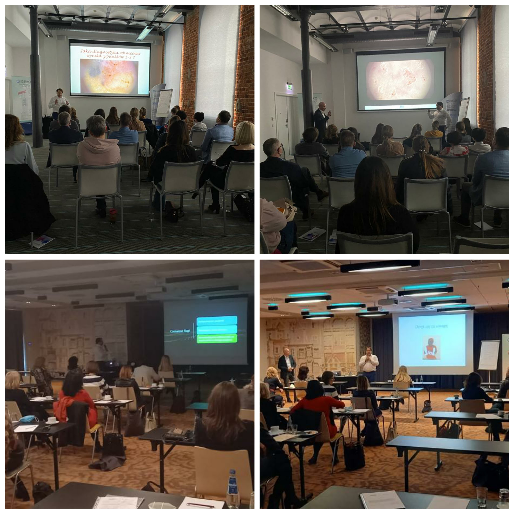

Akademia Dermatoskopii rozpoczęła cykl szkloleń dla dermatologów we współpracy z CERKO. Kursy odbyły się już we Wroclawiu i Łodzi. Kolejne planowane są w Gdańsku i Katowicach! Odbywający się cykl spotkań to druga odsłona kursu dermatoskopowego dla średnio zaawansowanych oparta o współczesne algorytmy, reguły, zasady i czerwone flagi obowiązujące w dermatoskopii.

Frekwencja uczestniczących w dotychczasowych kursach lekarzy bardzo nas zaskoczyła, a Państwa zaangażowanie i cheć nauki napędzają nas do dalszych działań!

Dziękujemy i do zobaczenia!

