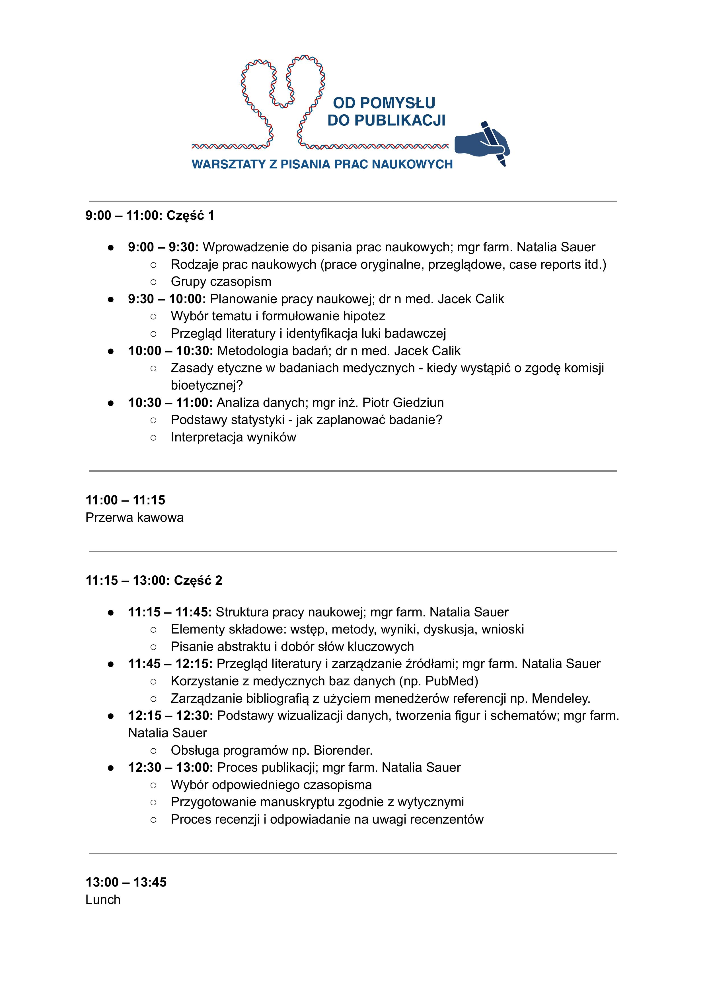
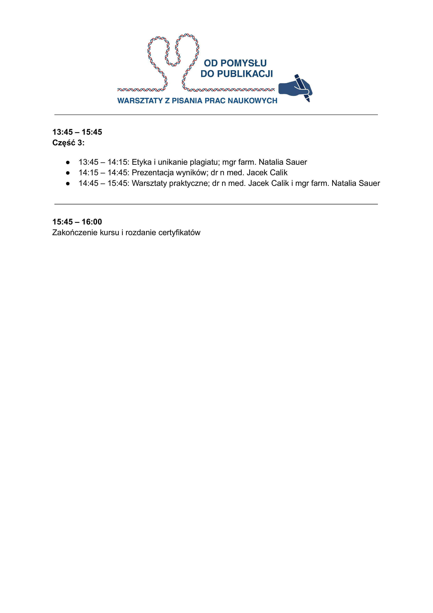

Akademia Dermatoskopii serdecznie zaprasza młodych badaczy, rozpoczynających swoją przygodę z publikacjami naukowymi, na kurs „Podstawy pisania prac naukowych w medycynie”

Celem kursu jest przekazanie uczestnikom podstawowej wiedzy i umiejętności, które ułatwią pracę nad pierwszymi publikacjami.

Podczas spotkania omówimy m.in.:

\-Jak poprawnie zaplanować badanie i sformułować hipotezę

\-Jak zarządzać literaturą i poprawnie cytować źródła

\-Jak tworzyć figury, schematy oraz wizualizować dane zgodnie z wymaganiami czasopism

Dodatkowo zaprezentujemy przydatne narzędzia do analizy statystycznej oraz udzielimy praktycznych wskazówek dotyczących przygotowania manuskryptu krok po kroku, zgodnie z wytycznymi redakcyjnymi czasopism

Zajęcia poprowadzą doświadczeni praktycy, którzy chętnie podzielą się swoją wiedzą i odpowiedzą na pytania uczestników. Wydarzenie będzie także doskonałą okazją do nawiązania nowych współprac naukowych

Zapraszamy wszystkich zainteresowanych do wspólnego zdobywania wiedzy i rozwijania swoich umiejętności w zakresie pisania prac naukowych!

Terminy: 1 marca i 31 maja!

Zapisy możliwe na 3 sposoby: poprzez formularz rejestracyjny dostępny na stronie [https://akademiadermatoskopii.pl/kursy/](https://l.facebook.com/l.php?u=http%3A%2F%2Fakademiadermatoskopii.pl%2Fkursy%2F%3Ffbclid%3DIwZXh0bgNhZW0CMTAAAR37_zL7DgnbWxouKuxk0lin9KaQHXqYDRqN3NhR09uCjhJhiLTWcU7PzYc_aem_vNbnC1cko4Ft2GpJYAEcIQ&h=AT2JkyYzvmKJ6uha_VNRryWPAsxua1VVABtn2HpoxKLI8y0IDNs-fN3ZkRC0IS9kMkI8SI1Ku-e0xisV-GZuCThd9d7ZYgN--4IiH4a9zJl8uJRI8V-cQZDZPvDESZBvlVKp&__tn__=-UK-R&c[0]=AT09PZZNof9IDL_LJXC-5X_5OZuNwsa6UIF-IQVZbyA0Zs88IppTpX5-jTKaUMoXkncfgIPeD0JMnJKYY5Q55UU2SYw9AzqXVInq7VOg9-yB0Po2koM4NeERtaZBv2A2_32cU-_iQR9EyVm_TE621GWW3i3WJi7dJGhWUSTfZBIl) telefonicznie: 516-516-065 lub mailowo: kontakt@akademiadermatoskopii.pl

Do zobaczenia!

