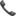

Dla wszystkich, którzy nie mogą doczekać się już kursów w kolejnym roku mamy bardzo dobre informacje! 

Podajemy terminy kursów na 2025 rok! 

Wrocław, 17-18.01.2025 Kurs dermatoskopowy podstawowy

Wroclaw, 25.01.2025 Chirurgia skóry

Wrocław, 21-22.02.2025 Kurs dermatoskopowy podstawowy

Wrocław, 14-15.03.2025 Kurs dermatoskopowy podstawowy

Wrocław, 21-22.03.2025 Kurs dermatoskopowy zaawansowany (współprowadzący dr n.med. Paweł Pietkiewicz)

Wrocław, 12.04.2025 Chirurgia skóry

Wrocław, 16-17.05.2025 Kurs dermatoskopowy podstawowy

Wrocław, 13-14.06.2025 Kurs dermatoskopowy zaawansowany (współprowadzący dr n.med. Paweł Pietkiewicz)

Agandy kursów dostępne na stronie: [https://akademiadermatoskopii.pl/kursy/](https://l.facebook.com/l.php?u=http%3A%2F%2Fakademiadermatoskopii.pl%2Fkursy%2F%3Ffbclid%3DIwZXh0bgNhZW0CMTAAAR1oIcgNI2SeePSNp_emPPZg3ItEz7aDMnuaARKdaAi-HEQs5a_lh7LWKfw_aem_-QALPmDDNRK8WrJ60UEqmA&h=AT19mgjjfs7opqG22vOLUM7V6-53DLLPaoj0RIgo4l6rf3xLdTYfpwNPYtM6Pfr-exxbuXYLvH-9Y750lAmZicfM61J8MspXF7GEXrYgNIp_Yzve3e02djjxx-XryNvMCilL&__tn__=-UK-R&c[0]=AT0XCDa4F3BmrTG5rMVgs1xptqUZtWqDftP0pPY5aN-diBL39_WumSrb3436mr2usm-wt9S20Q9LBgbULp9ROk_rw5A_iTwZ9EIz7wAfZb-bkOjVh-hAIiK86rgFiJ7uxZcW7MOoHMaH4dU9qNR8AiULKfpzRiQ_EwmniVPvs12xZeBjF79OFPXouzoOE6AHV02oMA)

Zapisy możliwe na 3 sposoby: poprzez formularz rejestracyjny dostępny na stronie [https://akademiadermatoskopii.pl/kursy/](https://akademiadermatoskopii.pl/kursy/?fbclid=IwZXh0bgNhZW0CMTAAAR24lT8tldMG9SI-WdUSk0xiYnb05CYTB0vpRx7KIN62KJ9lC5d6tCe7TQU_aem_s8gTsyGY8cZSX4gaKjmPIw) telefonicznie: 516-516-065 

lub mailowo: 

kontakt@akademiadermatoskopii.pl

Do zobaczenia!

