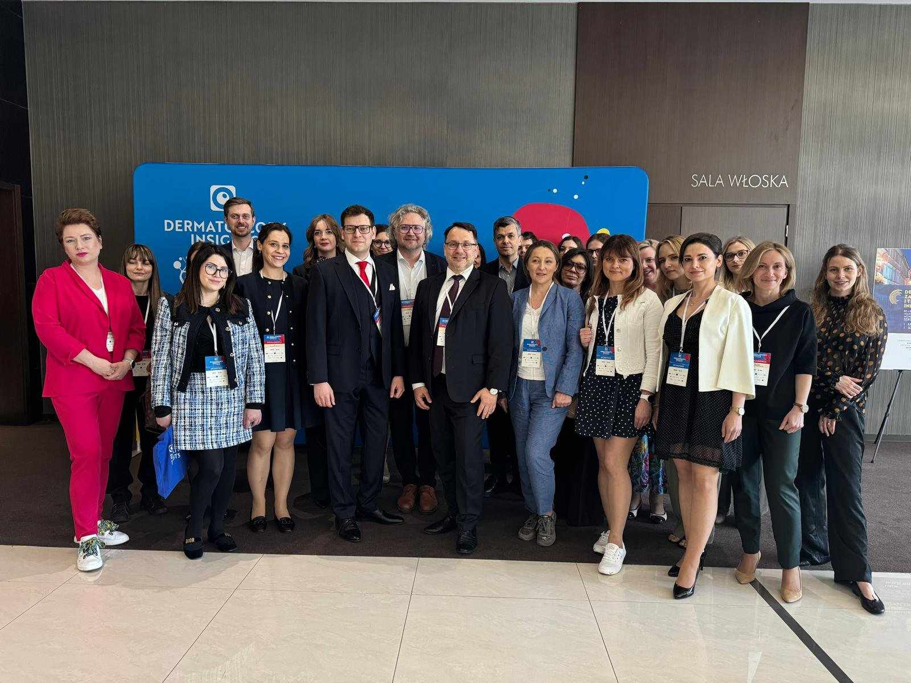
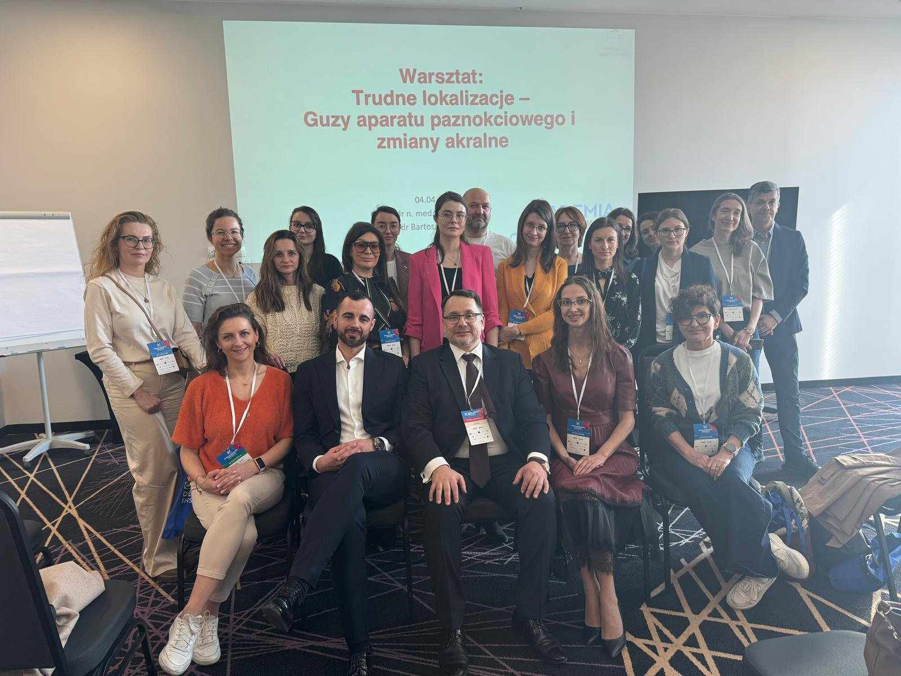
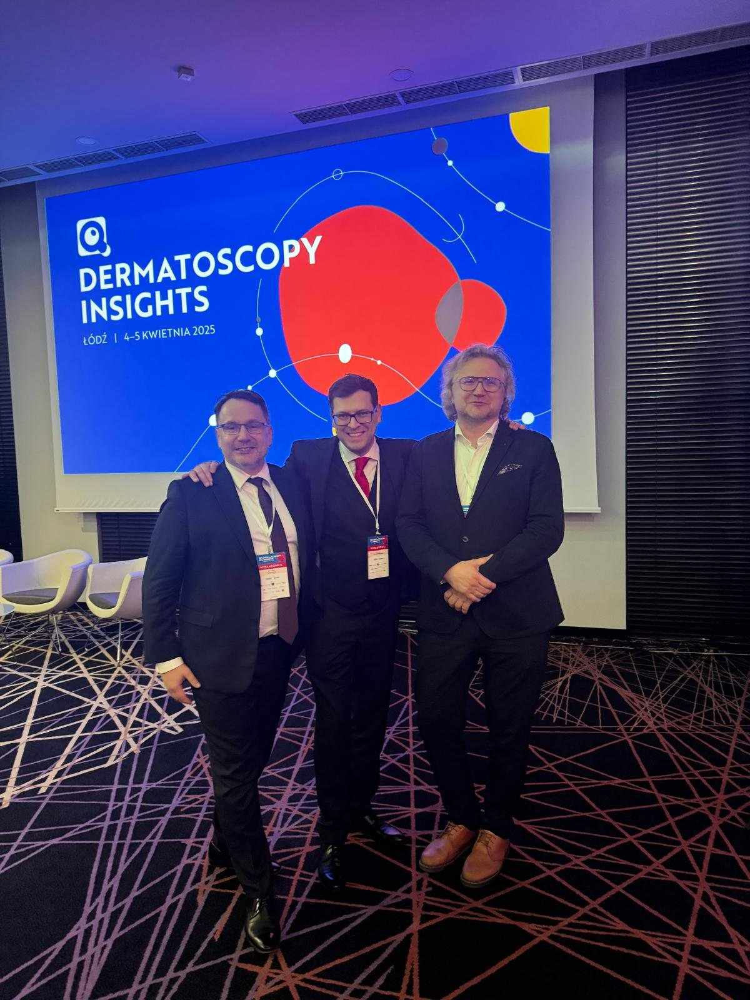
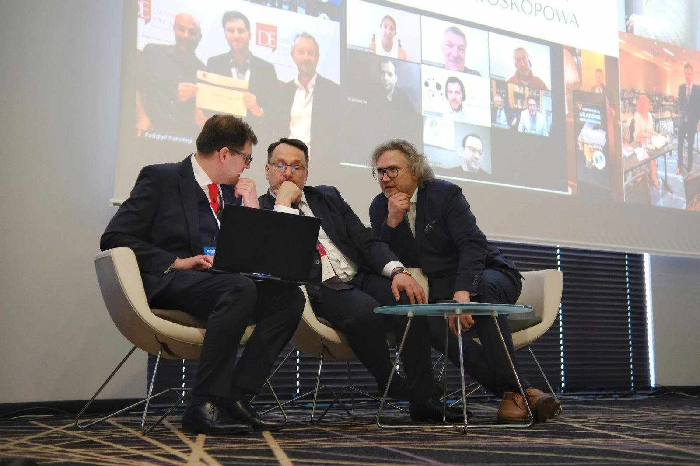
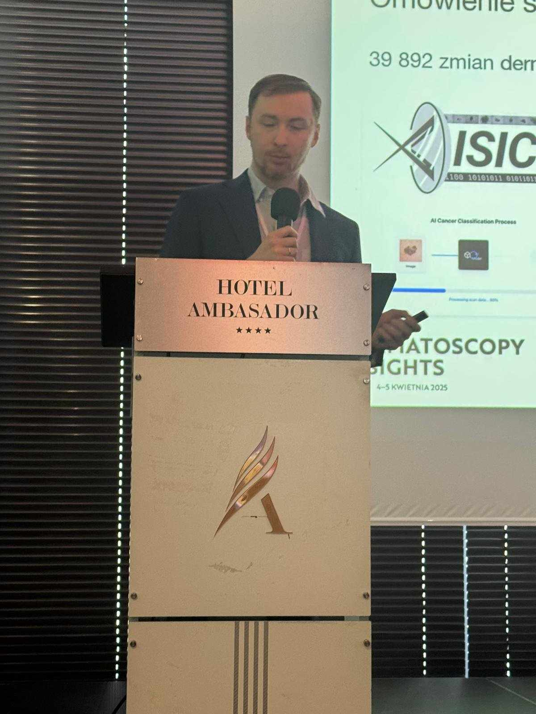
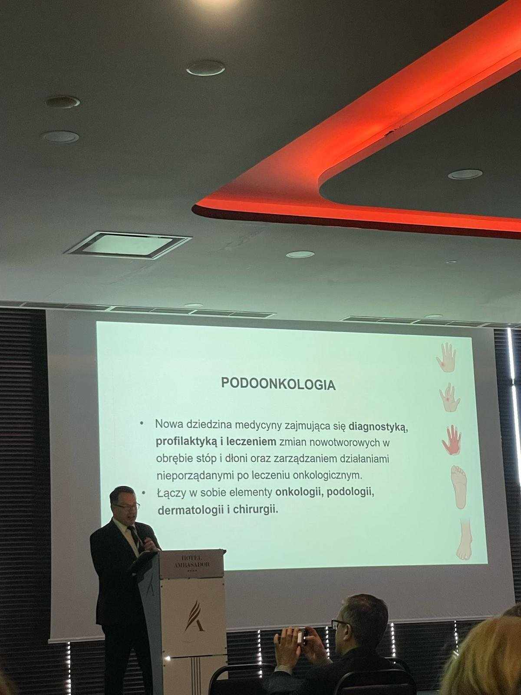
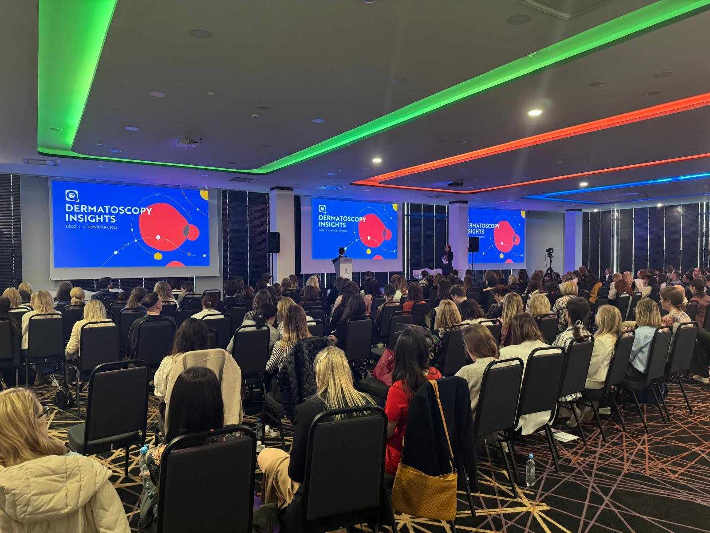
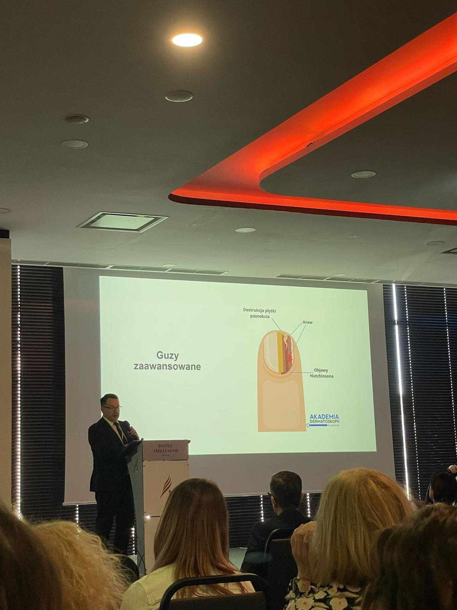
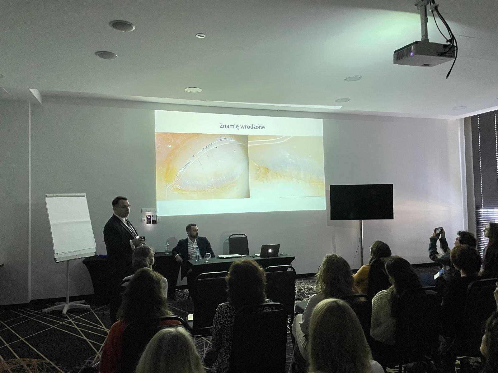

Za nami III Konferencja Dermatoscopy Insights organizowana przez Polską Grupę Dermatoskopową pod kierownictwem naukowym dr n. med. Jacka Calika, dr n.med. Michała Lewandowicza i dr n.med. Pawła Pietkiewicza!

Konferencja naukowa „Dermatoscopy Insights” odbyła się w miniony piątek i  
sobotę w dniach 4-5 kwietnia w Łodzi gromadząc ponad 270 lekarzy!

Konferencję rozpoczęły trwające jednoczasowo warsztaty – 5 różnych grup i 5 różnych bloków tematycznych. Akademia Dermatoskopii jako partner wydarzenia na czele z dr n.med. Jackiem Calikiem i lek. Bartoszem Woźniakiem mieli przyjemność poprowadzić warsztaty dotyczące Trudnych lokalizacji – guzów aparatu paznokciowego i zmian akralnych.

W Konferencji uczestniczyli wybitni wykładowcy – dermatolodzy, onkolodzy, chirurdzy i lekarze rodzinni, którzy zaprezentowali najnowsze trendy w diagnostyce i leczeniu nowotworów skóry. Co warto podkreślić wykładowcy nie pobierali wynagrodzeń, by móc przeszkolić jak największą liczbę lekarzy!

Tegorocznym gościem specjalnym był profesor Enzo Errichetti z Instytutu Dermatologii Szpitala Uniwersyteckiego Santa Maria della Misericordia w Udine, członek zarządu IDS (Włochy) i przewodniczący Imaging in Skin of Colour Task Force IDS.

Na zakończeniu Konferencji nie mogło zabraknąć Mistrzostw Dermatoskopii!

Dziękujemy uczestnikom za Państwa obecność i chęć dalszego doskonalenia oraz  
wszystkim wykładowcom za ogrom wiedzy, którą przekazali!

