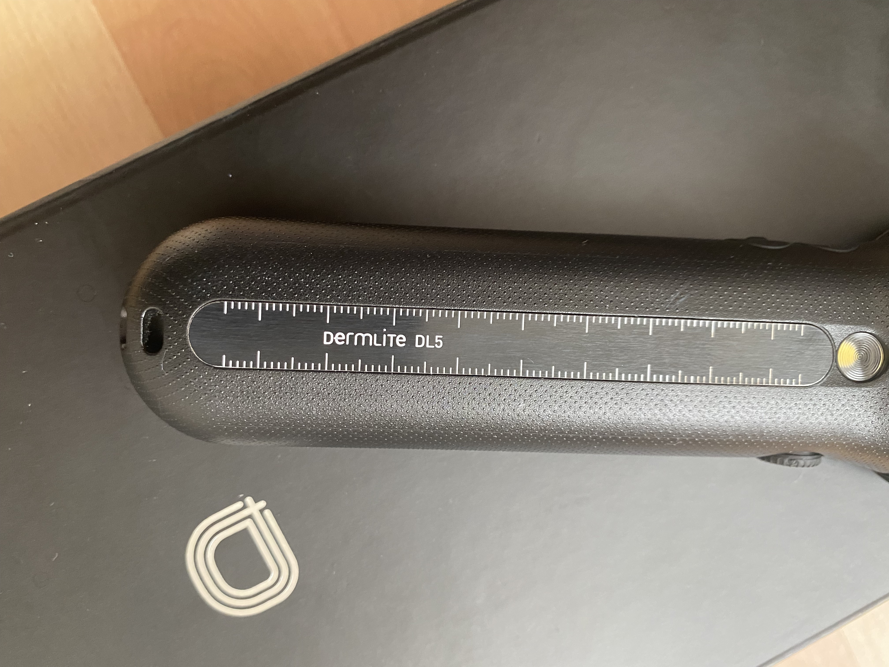
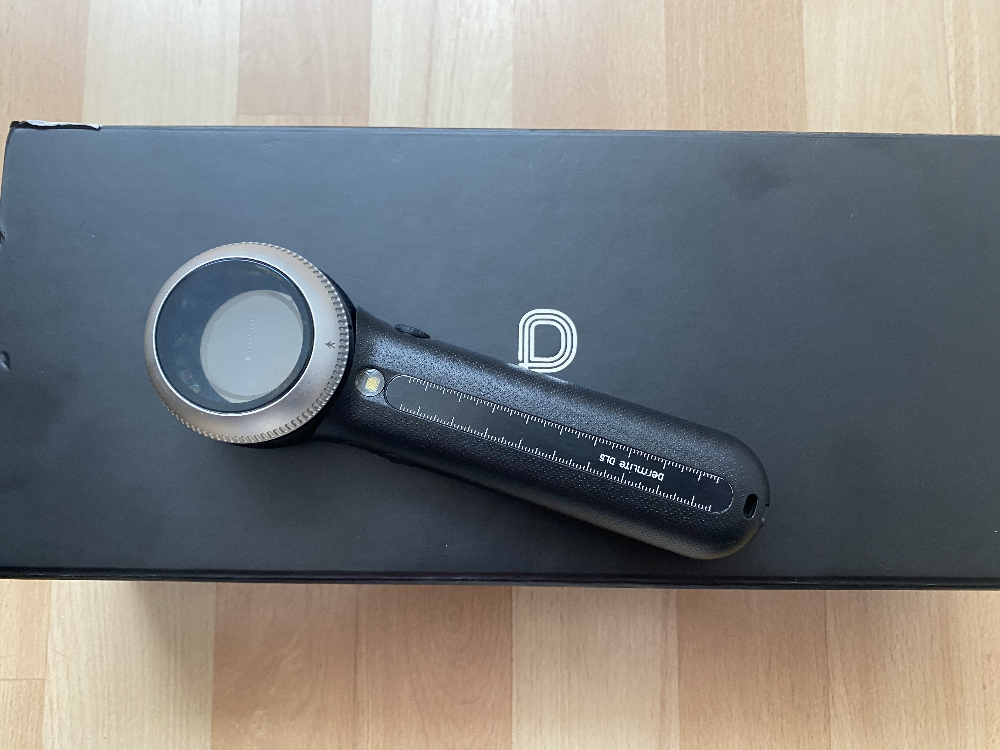
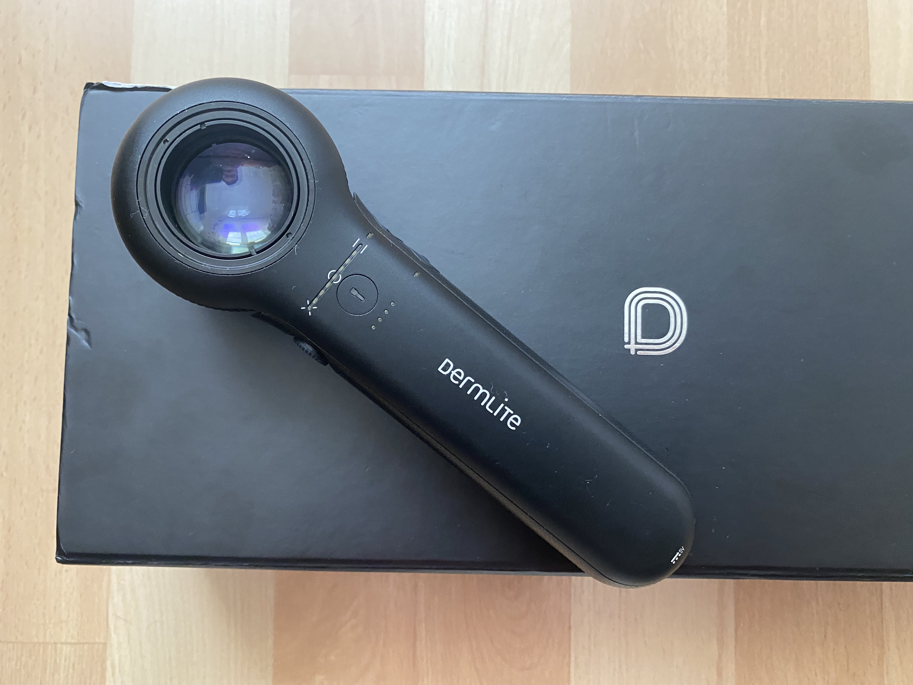
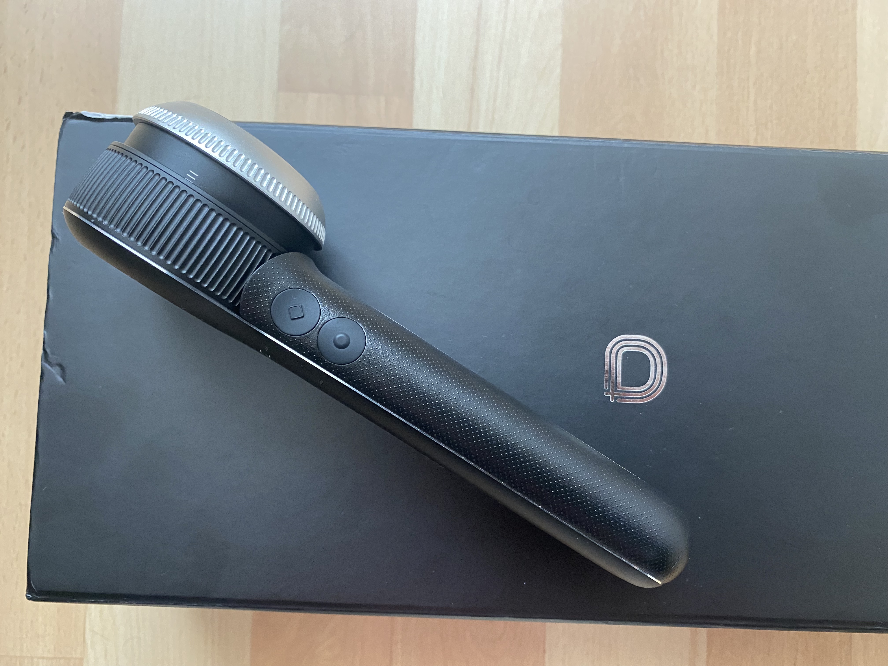
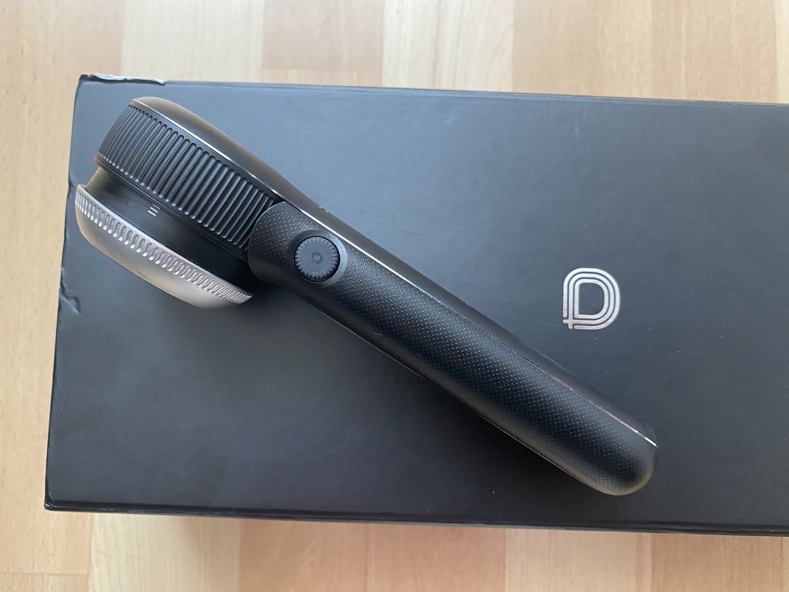

Podczas kursu dla średnio zaawansowanych dermatoskopistów w dniu 01.10.2022 uczestnicy mieli możliwość sprawdzenia **wszystkich topowych dermatoskopów** będących na rynku.

Gwiazdą tego kursu był dermatoskop **DERMLITE DL5**, który mile zaskoczył uczestników kilkoma nowościami min:

– 10 lat gwarancji!!!!!

– Polaryzację zmienia się płynnie pokrętłem będącym równocześnie wyłącznikiem

– Obecność polaryzacji równoległej (czego nie było do tej pory w dermatoskopach ręcznych)

– Funkcja PigmentBoost włączana osobnym przyciskiem oraz możliwość regulacji natężenia światła

– Tryb UV – światło 365 nm, z możliwością regulacji natężenia światła.

– Funkcja latarki – światło bardziej skupione niż z samego dermatoskopu. Moim zdaniem bardzo przydatne np. żeby zbadać śluzówkę jamy ustnej pacjenta.

– regulacja jasności światła podczas badania dermatoskopwego. Tym razem nie trzy opcje ale regulacja płynna, która wymaga naciśnięcia przycisku latarki i regulacja natężenia światła poprzez pokrętło.

– Oszczędność energii. DL5 wyłącza się sam automatycznie po 3 minutach braku aktywności.

– Linijka metalowa utrzymywana w zagłębieniu rękojeści z łatwą możliwością wyciągania poprzez ucisk na jej środkową część. Przydatna opcja przy dokumentacji zdjęciowej zmian skórnych.

– w standardowej wersji ładowarka biurkowa

– w standardowej wersji kabel do ładowania przez ładowarkę transformatorową.

– w stojaku ładowarki miejsce na nakładki ICECAP. Profilaktyka przenoszenia infekcji poprzez szkiełko kontaktowe.

– otwór do mocowania smyczy (nowość!!!)

– Trzeba też uważać!!! Wszystkie dermatoskopy z pierścieniami magnetycznymi (przydatna funkcja do robienia zdjęć celem stabilizacji aparatu poprzez adapter z dermatoskopem) DL5 trzeba trzymać z daleka od rozrusznika serca i innych urządzeń medycznych będących w ciele pacjenta.

Ogólnie DL5 wygląda na bardzo dobry dermatoskop. 

Więcej o nim napiszę po dłuższym użytkowaniu.

