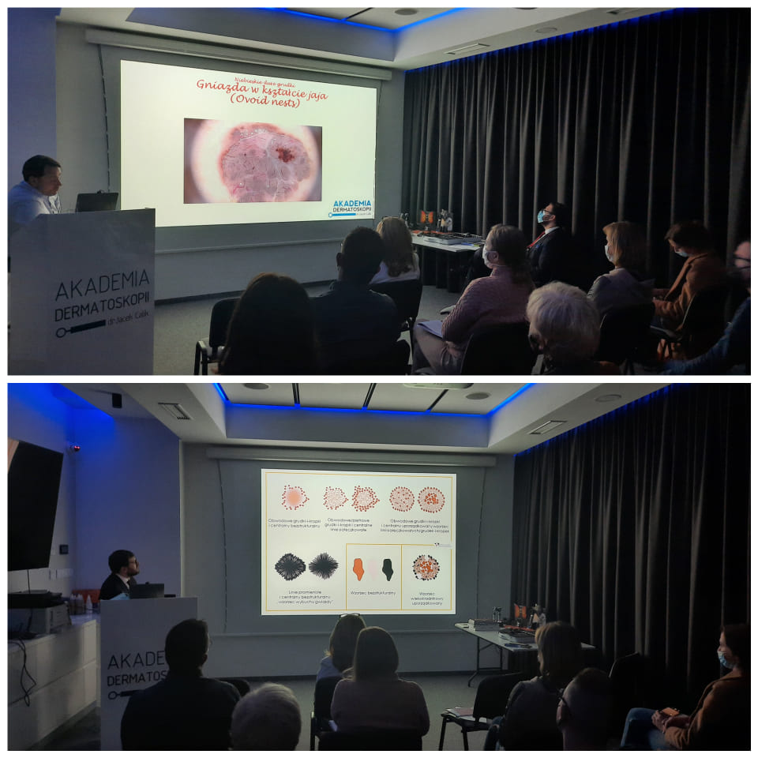

Długi weekend to najlepsza okazja do nauki dermatoskopii! Dlatego w Akademii Dermatoskopii doskonalimy swoją wiedzę podczas trwającego kursu dermatoskopowego na poziomie zaawansowanym. Kierownikiem naukowym i prawadzącym są dr n. med. Jacek Calik i dr n. med. Paweł Pietkiewicz. Dziś poruszymy następujące zagadnienia:

Chaos i Wzory – dermatoskopowy algorytm dla zmian barwnikowych

Przewidywanie bez barwnika – dermatoskopowy algorytm dla zmian bezbarwnikowych

Guzy keratynocytowe. Model progresji SCC

Znamiona barwnikowe wrodzone i szczególne typy znamion

SKINTEST przypadki kliniczne – ćwiczenia interaktywne

Już jutro:

Nowe trendy w diagnostyce nowotworów skóry

Pokaz sprzętu oraz pokaz mapowania skóry

Czerniaki podpaznokciowe

Czerniaki akralne

Czerniaki skory twarzy

Dermatoskopia w rzadkich nowotworach skóry

Inflamoskopia

Zmiany spitzoidalne

Newogeneza

Przypadki interaktywne z omówieniem

-   
