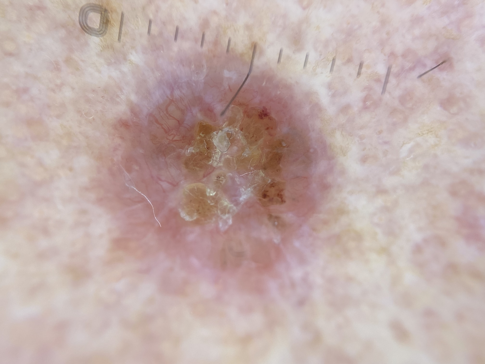
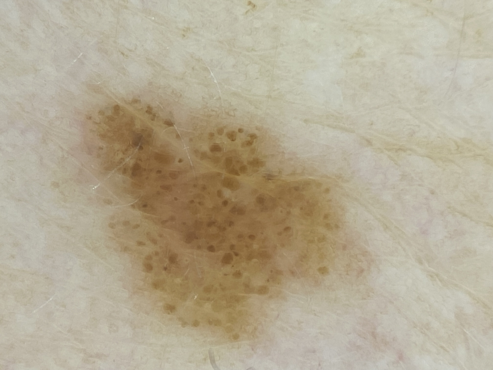
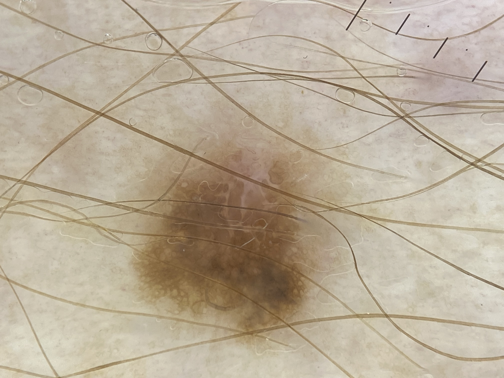
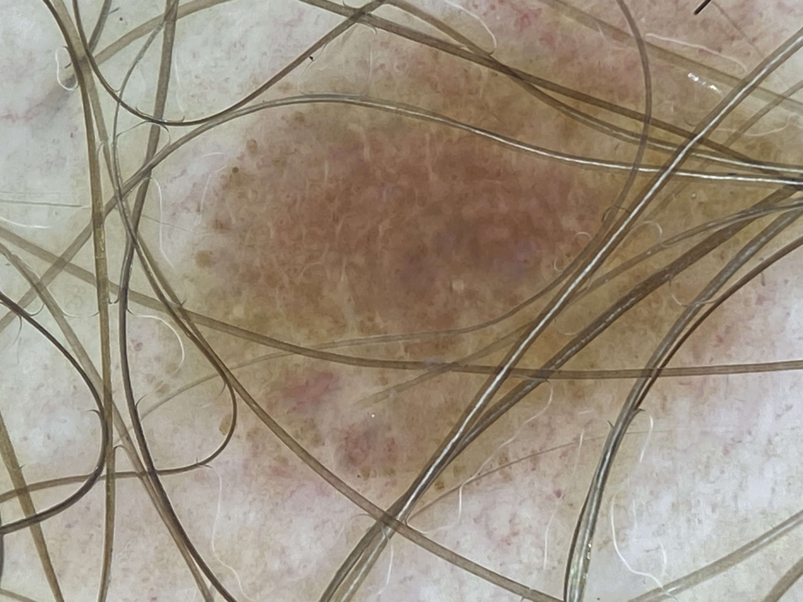

W poniedziałek 11.12.2024 w Kamiennej Górze odbyło się badanie profilaktyczne pacjentów przeprowadzane przez lekarzy z Uniwersyteckiego Szpitala Klinicznego im Jana Mikulicza-Radeckiego.

Badanie przeprowadzali: dr n. med. Jacek Calik (Oddział Onkologii Klinicznej) oraz dr Mateusz Mateuszczyk (Klinika Dermatologii)

Badanie profilaktyczne cieszyło się dużym zainteresowaniem. Przebadaliśmy około 50 osób

Oto niektóre znaleziska z wczorajszej akcji, które wymagają dalszego leczenia!

To jest niezbity dowód na to, iż badanie tzw. „gołym okiem” nie jest tak skuteczne jak badanie dermatoskopowe!

Zachęcamy wszystkich do regularnej profilaktyki

