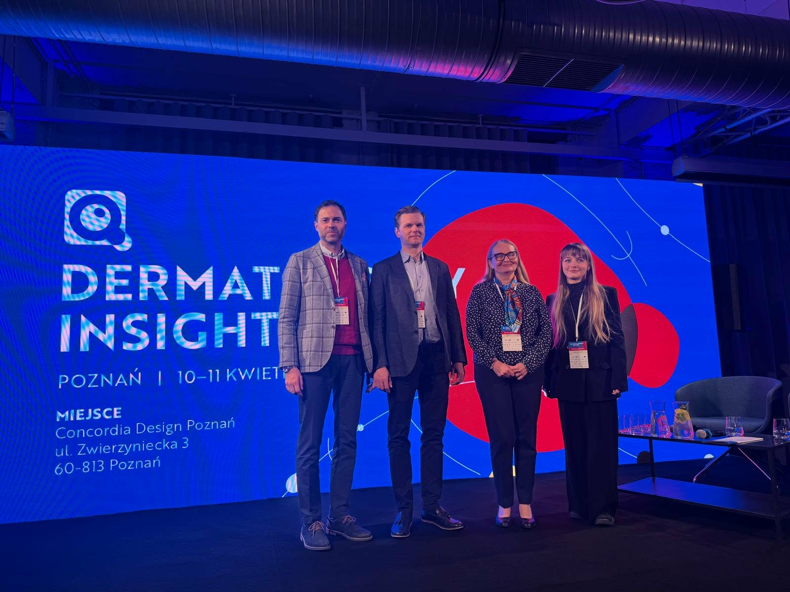
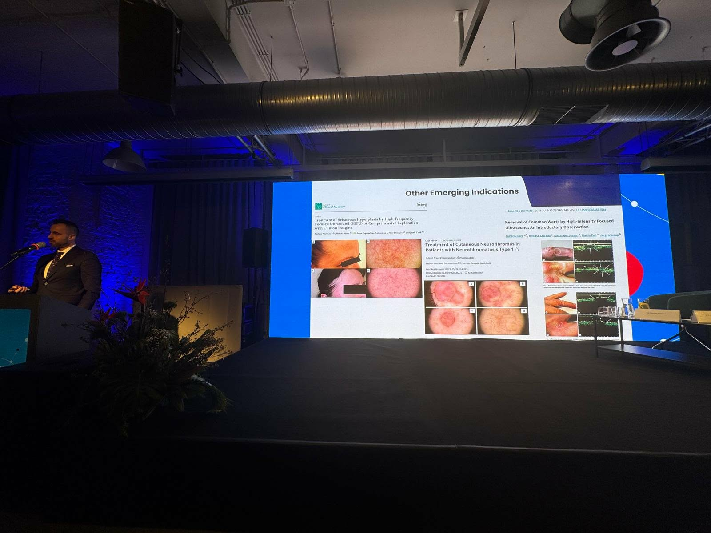
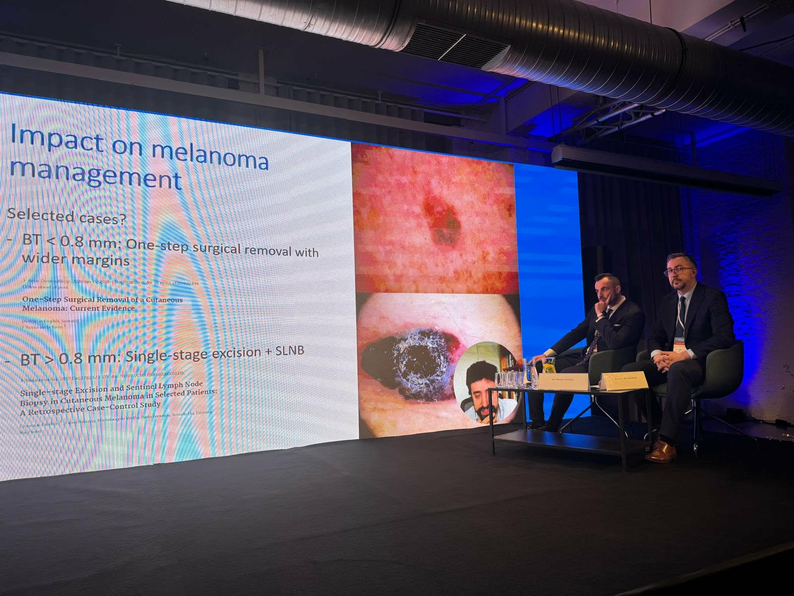
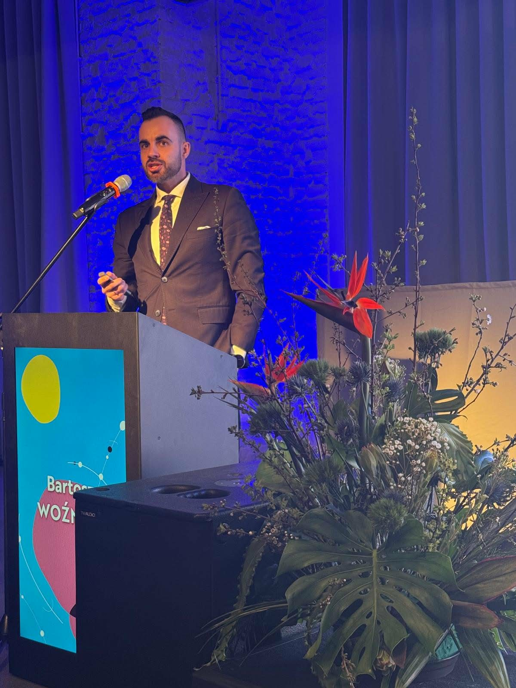

Drugi dzień Konferencji Dermatoscopy Insights rozpoczęła sesja dermatoonkologiczna. Wykłady wygłosili prof. dr hab.n. med. Jacek Mackiewicz, prof. dr hab.n. med. Wojciech Wysocki, dr n. med. Natalia Salwowska oraz prof. dr hab.n. med. Monika Prochorec -Sobieszek. Zaraz po niej w roli przewodniczącego anglojęzycznej sesji przypadków lek. Bartosz Woźniak!

