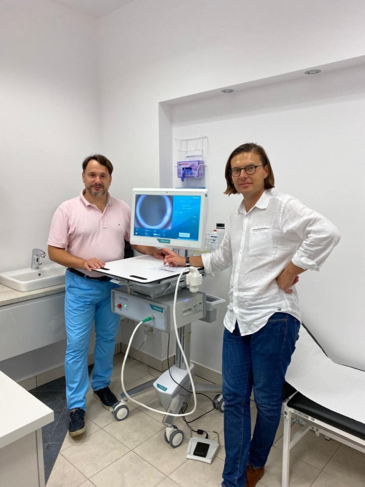

Międzynarodowa scena dermatoskopii – bądź jej częścią!

Dziś przybliżamy zakres temetyczny kolejnego warsztatu!

HIFU – ultradźwięki o wysokiej intensywności zintegrowane z obrazem dermatoskopowym w różnych wskazaniach skórnych

Udział w warsztacie jest unikalną okazją, by pracować na urządzeniu System ONE-M duńskiej firmy TOOsonix – jedynego urządzenia z rejestracją MDR w Europie wykorzystującego skupioną falę akustyczną do zabiegów terapeutycznych w skórze!

Zabieg przebiega pod kontrolą zintegrowanego dermatoskopu, w czasie rzeczywistym, dając lekarzom unikalną możliwość niezwykle precyzyjnej kontroli zabiegu. System ONE-M ma szerokie spektrum wskazań dermatologicznych między innymi: rak podstawnokomórkowy skóry, rogowacenie słoneczne, rogowacenie łojotokowe a także inne łagodne zmiany w skórze właściwej i naskórku.

Terapia z wykorzystaniem skupionych ultradźwięków charakteryzuje bardzo korzystnym profilem gojenia po zabiegu, połączonym z bardzo dobrym wynikiem kosmetycznym co jest szczególnie ważne w leczeniu zmian w lokalizacjach wrażliwych.

Omawiane zagadnienia

\-podstawy fizyczne terapii skóry z wykorzystaniem skupionej wiązki akustycznej

\-przykłady kliniczne

\-zasady bezpiecznej pracy

\-wskazania i przeciwskazania

\-przygotowanie sytemu do pracy z pacjentem

\-dobór parametrów wiązki i głębokości penetracji

Warsztat polecany jest szczególnie lekarzom zainteresowanym nowoczesnymi nie-inwazyjnymi metodami terapii skóry. Osobom poszukującym rozwiązań o bardzo korzystnym profilu leczenia z szerokim spektrum wskazań.

Po warsztacie uczestnik otrzyma certyfikat uprawniający do pracy na urządzeniu TOOsonix System ONE-M

Warsztat poprowadzi sam konstruktor, dr n. tech. inż. Tomasz Zawada (Toosonix) oraz doświadczony lekarz i autor publikacji naukowych, dr n. med. Jacek Calik, twórca pierwszego na świecie kompendium o ultradźwiękach w dermatologii!

Rejestracja: [https://www.mp.pl/konferencje/akademia-dermatoskopii/2025/](https://www.mp.pl/konferencje/akademia-dermatoskopii/2025/?fbclid=IwZXh0bgNhZW0CMTAAYnJpZBEwTUNrMGUwRmJhR05XcGFmNQEex2tL58PAiTM6az2u6iyuotv1IOQAXMlzTr13yQiansoVGdK6kkNPjRBEY4A_aem_Gfh4GCCd4mLw2g7ZJF421g)

Twoja praktyka zasługuje na tę wiedzę – dołącz do nas we Wrocławiu!

