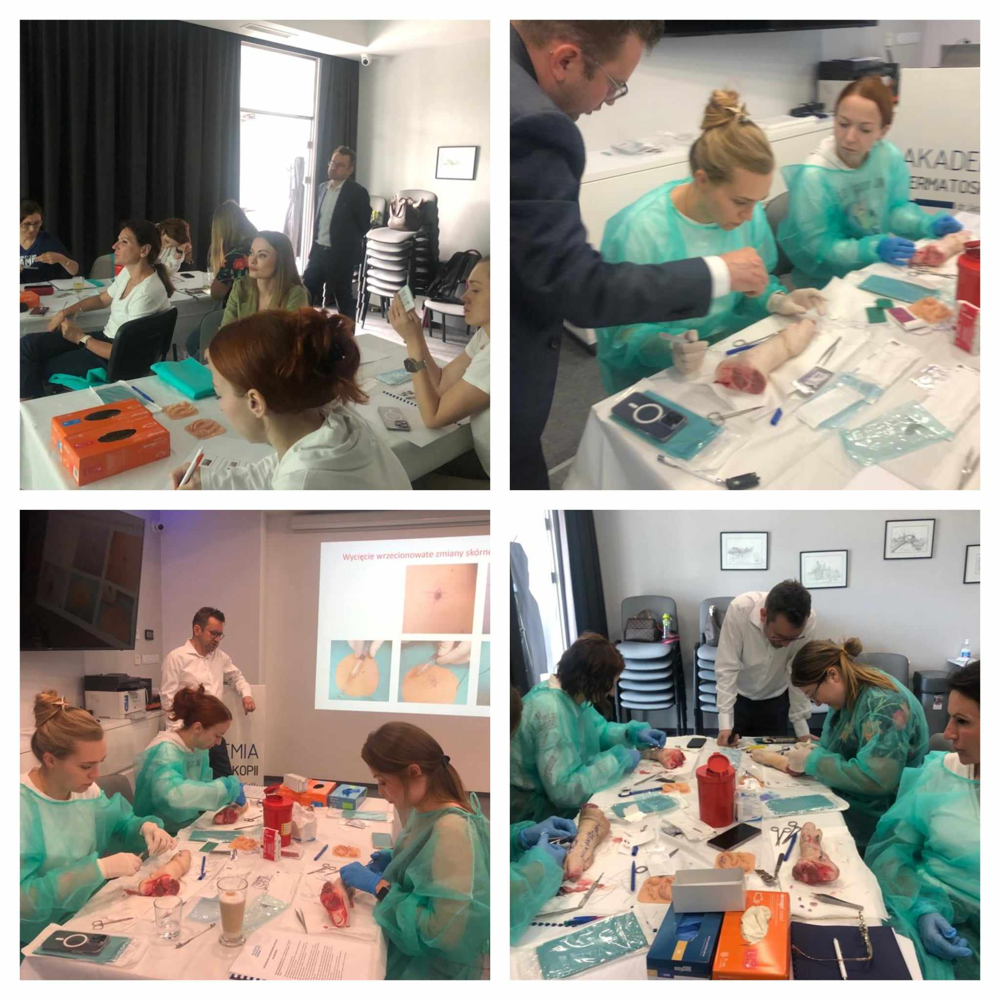

Jeśli nauka wycinania, szycia i zakładania szwów to tylko z dr. n. med. Markiem Łuciukiem!

Zapraszamy na intensywne warsztaty z Chirurgii skóry! Zostały ostatnie 3 wolne miejsca!

Termin: 25.11.2023

Kurs poprowadzi niezmiennie dr n.med. Marek Łuciuk!

Zapisy: kontakt@akademiadermatoskopii.pl lub 516-516-065

Agenda kursu dostępna na stronie: [https://akademiadermatoskopii.pl/kursy/](https://akademiadermatoskopii.pl/kursy/?fbclid=IwAR2u77M-mRkIogQBCgyACvSz7IoK9xvy09LQbI7dShpdY0foMLGEQNiO6ig)

Do zobaczenia!

