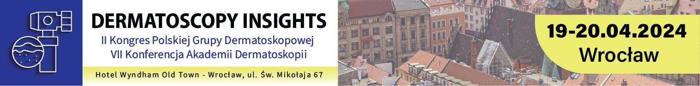

Już coraz bliżej do VII Konferencji Akademi Dermatoskopii połączonej z II Kongresem Polskiej Grupy Dermatoskopowej  
Data: 19-20.04.2024  
Miejsce: Wyndham Wrocław Old Town ul. św. Mikołaja 67

Zapisy i szczegóły uczestnictwa: [https://dermatoscopyinsights.pl/](https://dermatoscopyinsights.pl/)  
Strona wydarzenia na facebook: [https://www.facebook.com/events/643645354499884](https://www.facebook.com/events/643645354499884)

Jednocześnie zapraszamy do zapisów na poranne piątkowe warsztaty prowadzone przez dr n.med. Jacka Calika!  
Wyjątkowe warsztaty, na których omawiane będzie zastosowanie sztucznej inteligencji w praktyce klinicznej. Dowiemy się także czy i w jakim zakresie sztuczna inteligencja wspiera w decyzjach terapeutycznych w rozpoznawaniu zmian skórnych przy użyciu różnych jej modeli.  
Wiecej na stronie [https://dermatoscopyinsights.pl/](https://dermatoscopyinsights.pl/) w zakładce WARSZTATY.  
Do zobaczenia!

