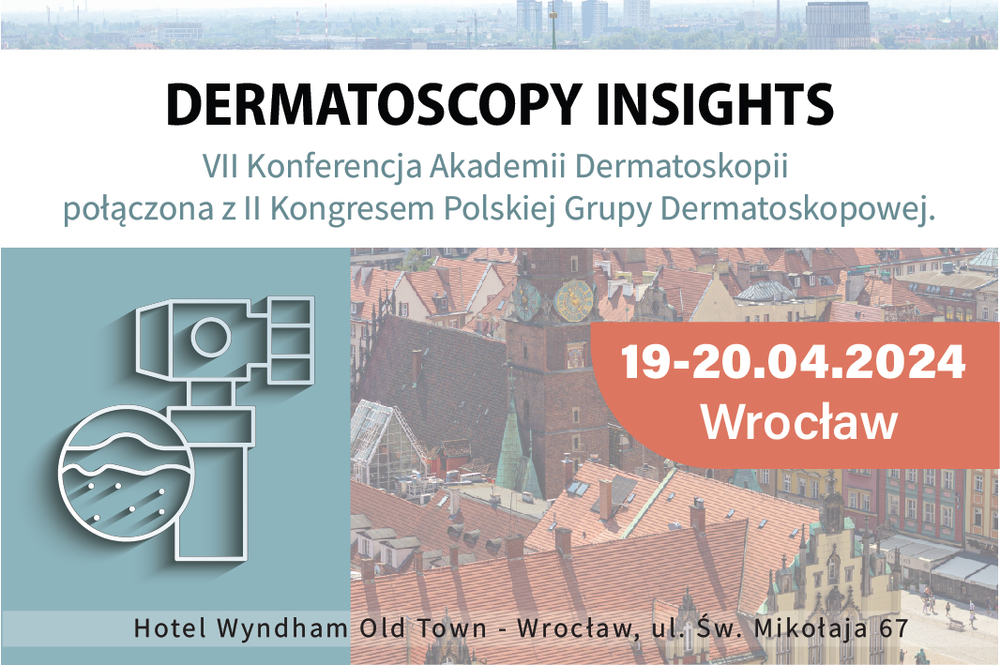

Już nie mogliśmy się doczekać, aby móc przekazać Państwu wiadomość, że ruszyły zapisy na VII Konferencję Akademii Dermatoskopii połączoną z II Kongresem Polskiej Grupy Dermatoskopowej!

Data: 19-20.04.2024

Miejsce: Wyndham Wrocław Old Town ul. św. Mikołaja 67

Zapisy i szczegóły uczestnictwa: [https://dermatoscopyinsights.pl/](https://l.facebook.com/l.php?u=https%3A%2F%2Fdermatoscopyinsights.pl%2F%3Ffbclid%3DIwAR2ygcCIPxVOzjBu3fDk4QbXJTKdRMGStbRhyb8W5RRttdz51HtpG5_sbdo&h=AT1mXUxXqf0wAQsAJ0Pp5Go-ktZLWbJ-8J2y3Ql87vlZGdErLVK3V2RlOimqabOl7PubeTN0-DubXndvwQSBCd50XwCociJjWBR9iraUdjucJkSiunLw-hpDCjoCqQRblIhs&__tn__=-UK-R&c[0]=AT1yEe-tVoS_bWNpaWcDruTT6UuxJAQL1uQ2_vvA0rvFSkOzI26yUNXA4SJfiDul2yCtrSXrvIsOJLsuo4iopxRxDnkPP40dI6PHW2PENSof3a4ftjxa4_I4pWj6UHjYQ86SgoVb-llynMrJRQTl5fkep4x8nQ)

Tegorocznym gościem specjalnym „Dermatoscopy insights” będzie profesor Caterina Longo z Kliniki Dermatologii Università degli Studi di Modena e Reggio Emilia, Sekretarz Generalny International Dermoscopy Society!

Wykłady wygłosi wielu wybitnych specjalistów – dermatologów, onkologów, chirurgów oraz lekarzy rodzinnych.

Jak co roku będzie to spotkanie interdyscyplinarne, by łączyć wiedzę i doświadczenie!

Przygotowaliśmy także coś specjalnego!

Piątkowy poranek zaczniemy od warsztatów! Jednocześnie odbywać będą się dwa rożne warsztaty praktyczne w grupach. Jeden z nich dotyczyć będzie dermatoskopii cyfrowej, drugi dermatoskopii praktycznej. Wiecej na stronie [https://dermatoscopyinsights.pl/](https://l.facebook.com/l.php?u=https%3A%2F%2Fdermatoscopyinsights.pl%2F%3Ffbclid%3DIwAR2ZmLwuxPm4t8-zVZtrk03mZy4jlITyxTl_OPvQWtb1lI3U80qYB2u8RuE&h=AT1mXUxXqf0wAQsAJ0Pp5Go-ktZLWbJ-8J2y3Ql87vlZGdErLVK3V2RlOimqabOl7PubeTN0-DubXndvwQSBCd50XwCociJjWBR9iraUdjucJkSiunLw-hpDCjoCqQRblIhs&__tn__=-UK-R&c[0]=AT1yEe-tVoS_bWNpaWcDruTT6UuxJAQL1uQ2_vvA0rvFSkOzI26yUNXA4SJfiDul2yCtrSXrvIsOJLsuo4iopxRxDnkPP40dI6PHW2PENSof3a4ftjxa4_I4pWj6UHjYQ86SgoVb-llynMrJRQTl5fkep4x8nQ) w zakładce WARSZTATY.

Podczas Konferencji nie mogło by zabraknąć gościa specjalnego Profesora Jana Miodka, który swoim wykładem uświetni i zamknie pierwszy dzień Konferencji!

A na koniec nasze i Państwa ulubione Mistrzostwa Dermatoskopii!

Zapowiadają się dwa dni pełne nauki i wymiany doświadczeń!

Do zobaczenia we Wrocławiu!

