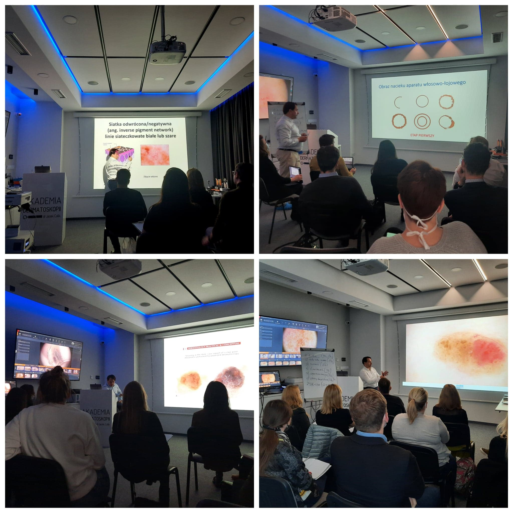

Kolejny kurs dermatoskopowy na poziomie podstawowym tuż po V Konferencji Akademii Dermatoskopii!

Termin: 22-23.04.2022!

Miejsce szkolenia: Akademia Dermatoskopii ul. Wyspiańskiego 11 Wrocław

Prowadzący szkolenie: dr n. med. Jacek Calik

Zakres szkolenia:

Obecne możliwości technologiczne diagnostyki nowotworów skóry

Badanie dermatoskopowe oraz struktury dermatoskopowe – nazewnictwo

Diagnostyka zmian barwnikowych skóry – wzorce barwnikowe i algorytmy

Dermatoskopia nowotworów niebarwnikowych skóry – raki skóry

Czerniaki skóry – rozpoznanawanie

Zmiany akralne i podpaznokciowe

Czerniaki skóry twarzy

Przydatkowiaki

Czerniaki błony śluzowej jamy ustnej

Przykład badania wideodermatoskopowego – warsztaty

Zastosowanie dermatoskopii w onkologii i w innych dziedzinach medycyny

Zapraszamy do zapisów przez stronę [https://akademiadermatoskopii.pl/kontakt/](https://akademiadermatoskopii.pl/kontakt/?fbclid=IwAR0h8dZYvjjbu9wxBXL3cBKUTFgnThwmfZ-v1cIEGkFp5p85VFbEQfhxQI0)lub do kontaktu telefonicznego 516-516-065

Do zobaczenia!

