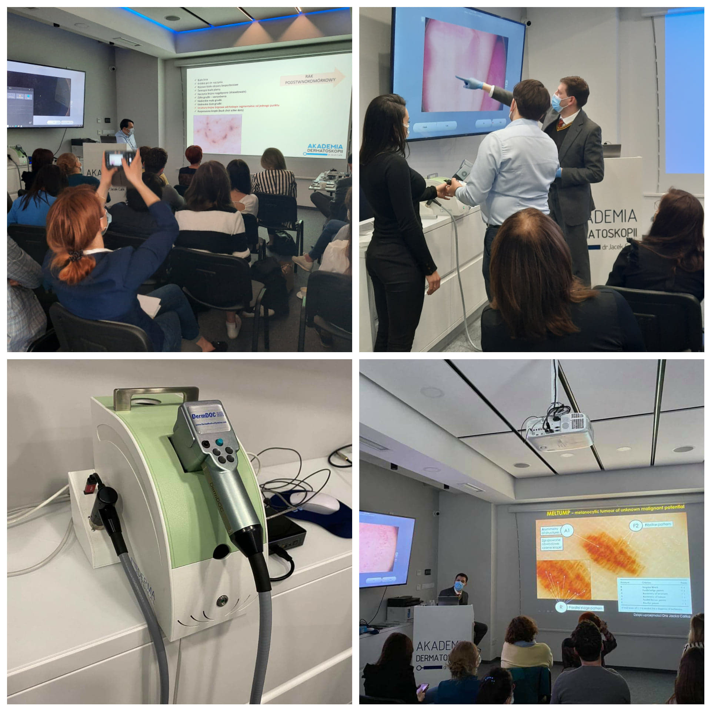

Kolejny kurs dermatoskopowy za nami! Tym razem na poziomie zaawansowanym pod kierownictwem naukowym dr n. med. Jacka Calika i dr n. med. Pawła Pietkiewicza.

Dziękujemy uczestniczącym w kursie lekarzom za zaangażowanie i chęć nauki. To wyjątkowe spotkanie obfitujące w wiedzę dotyczącą diagnostyki i leczenia zmian skórnych. Wyjątkowe także dlatego, że po raz pierwszy mieliśmy do dyspozycji wideodermatoskop MoleMax HD austriackiej firmy Derma Medical System, dzięki któremu mogliśmy wspólnie obserować i omówić niezwykle ciekawe przypadki.

Niezmiennie zapraszamy Państwa do zapisów na kolejne kursy!

