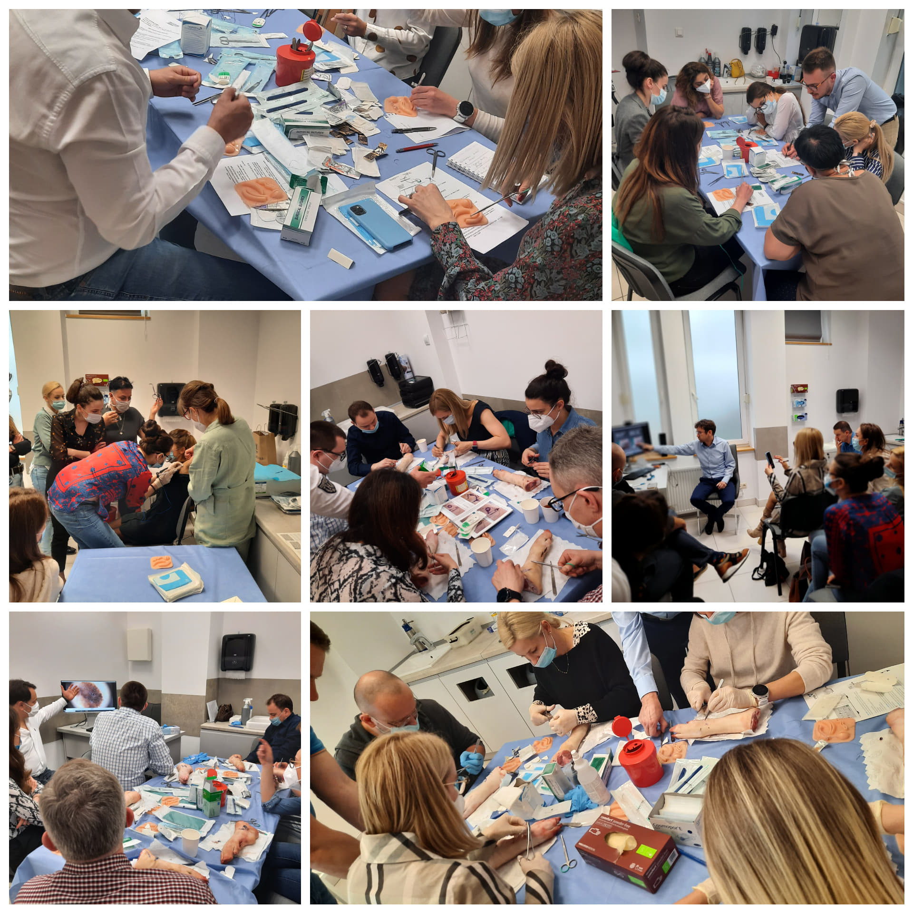

Zaledwie kilka godzin temu zakończył się kolejny w tym roku kurs z chirurgii skóry pod kierownictwem naukowym dr n. med. Marcina Ziętka. Kurs chirurgii skóry to połączenie teorii z praktyką, dlatego zagadnienia pierwszego dnia szkolenia dotyczyły epidemiologii i rozpoznawania nowotworów skóry, zastosowania chirurgii w leczeniu zmian nowotworowych i nienowotworowych. Uczestniczący w kursie lekarze poznali także podstawy kriochirurgii w dermatologii, a także mieli okazję poszerzyć swoją wiedzę na temat materiałów szewnych, rodzajów igieł i plastrów.

Drugi dzień szkolenia to część praktyczna, którą rozpoczęliśmy od ćwiczeń na trenażerach, by móc przejść do zabiegów elektrochirurgii, HIFU oraz biopsji podpaznokciowej.

Dziękujemy uczestniczącym w kursie lekarzom, bo było ich aż 17-stu, wszystkim wykładowcom za zaangażowanie i chęć dzielenia się doświadczeniem i wiedzą oraz trenerom, którzy szkolili i służyli pomocą podczas zajęć poświęconych wycinaniu zmian, zakładaniu szwów i podwiązywaniu naczyń.  
Niezmiennie zapraszamy na kolejne kursy! Wszystkie zawsze dostępne na stronie w zakładce „Kursy”

