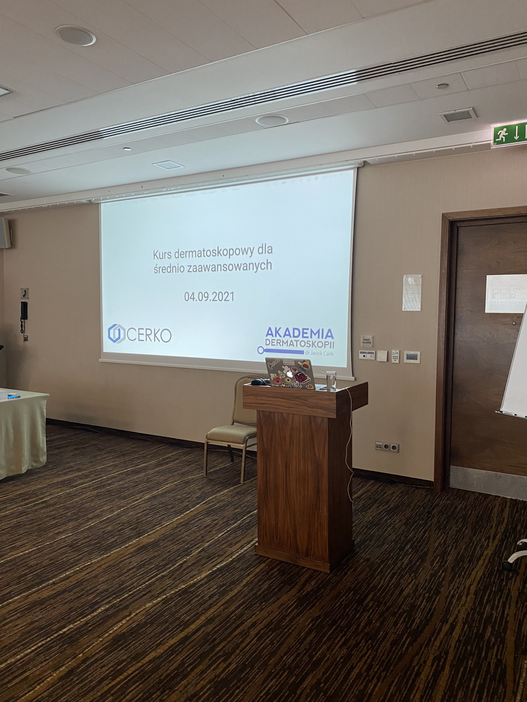

W dniu 04.09.2021 odbył się w hotelu Hilton kolejny kurs dermatoskopowy dla średnio zaawansowanych organizowany przy wspłpracy z Firmą CERKO. Atmosfera w Krakowie doskonała!!! Dziękuję wszystkim lekarzom uczestniczącym w kursie za aktywny udział. Dziękuję również Panu Doktorowi Pilarskiemu za bardzo ciekawy wykład pt.: Tajemnice emolientów. Do zobaczenia we Wrocławiu na kolejnych szkoleniach i konferencji Akademii Dermatoskopii 8-9.04.2022.  
Pozdrawiam Jacek Calik

