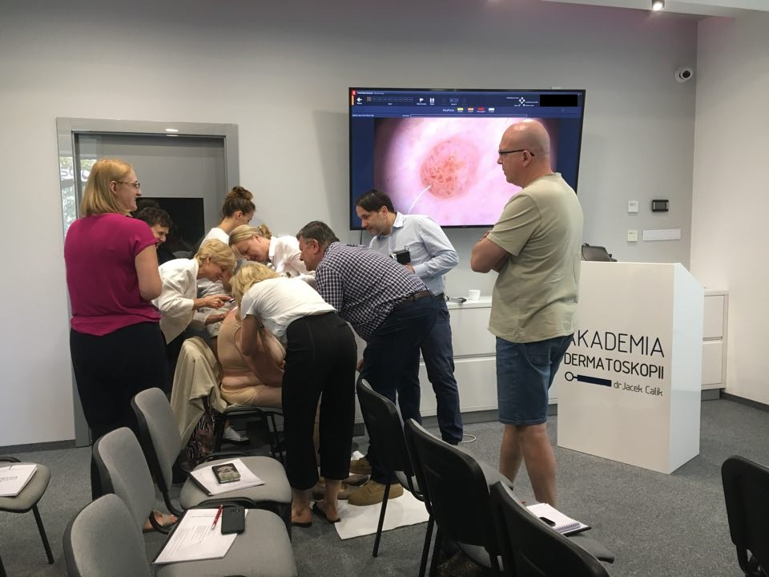
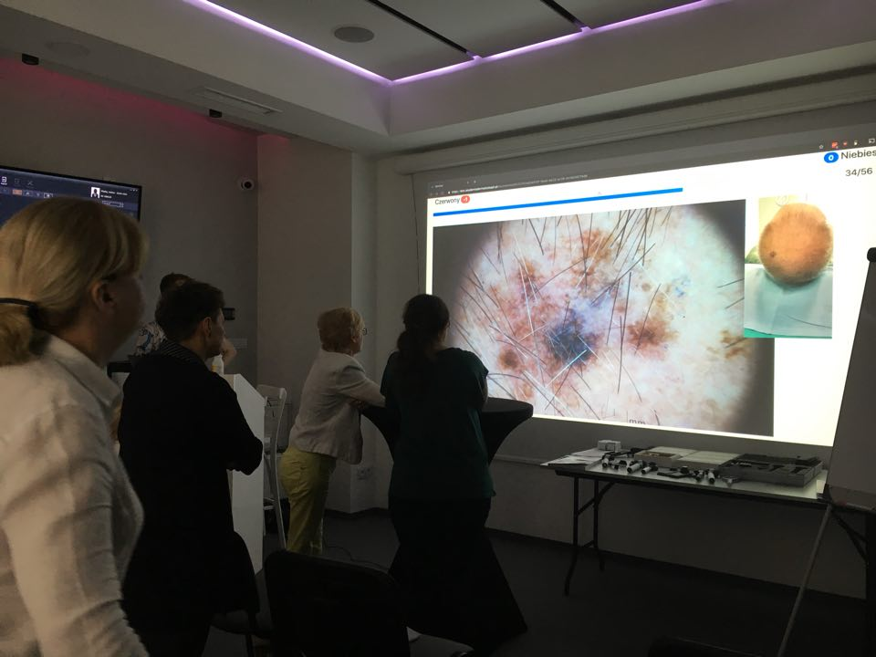
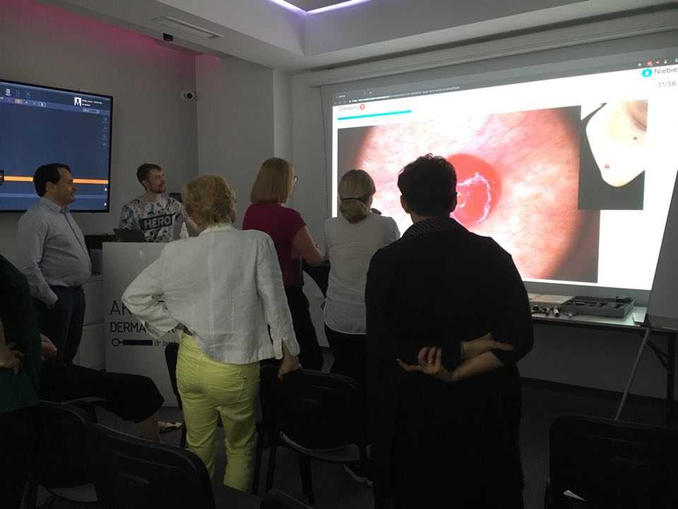
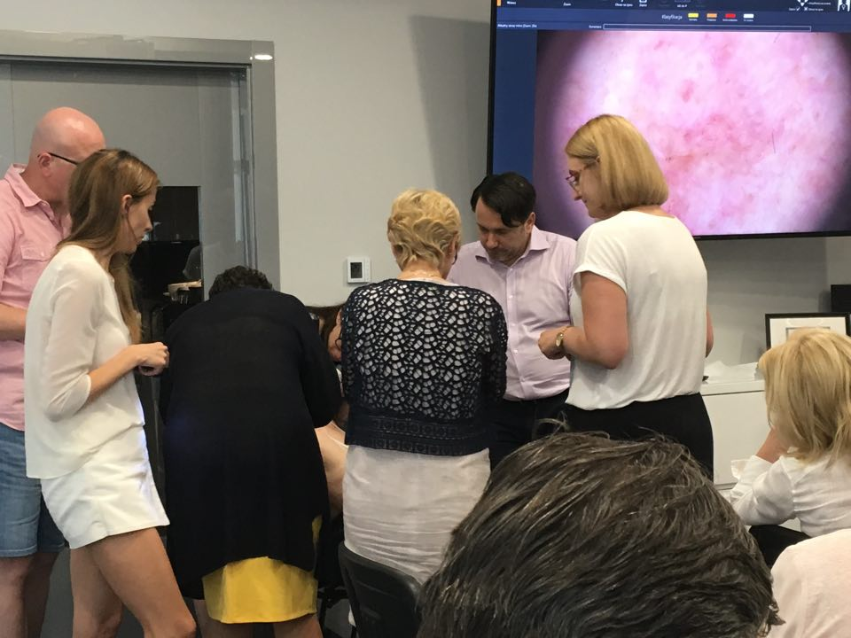

W dniach 15-16.06.2019 odbył się kolejny kurs w Akademii Dermatoskopii. Super uczestnicy. Dużo ciekawych pacjentów. Dużo przekazanej wiedzy połączonej z praktyką. Wszyscy lekarze uczestnicy kursu rywalizowali na koniec szkolenia w zawodach dermatoskopowych.

Dziękuję za wspólne spędzony weekend. Było warto!!!

-   
    
-   
    
-   
    
-   
