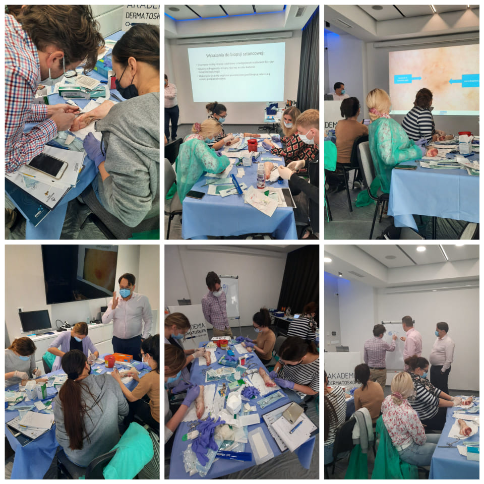

Kurs z Chirurgii skóry już za nami! Kierownikiem naukowym kursu był dr n. med. Marcin Ziętek oraz dr n. med. Jacek Calik. Chirurgia skóry to połączenie części teoretycznej z częścią praktyczną. Podczas kursu poruszane były tematy dotyczące epidemiologii i rozpoznawania nowotworów skóry oraz zastosowania chirurgii w leczeniu zmian nowotworowych i nienowotworowych. Uczestniczący w kursie lekarze mieli okazję poznać podstawy kriochirurgii i elektrochirurgii w dermatologii. Podczas szkolenia z chirurgii skóry nie mogło zabraknąc zajęć praktycznych na trenażerach. Uczestnicy trenowali wycinanie zmian, zakładanie szwów i podwiązywanie naczyń. Część praktyczna poświęcona była także technikom wykonania biopsji sztancowej, zabiegom elektrochirurgicznym i kriochirurgicznym. Dziękujemy uczestnikom za zaangażowanie i chęć doskonalenia swojej wiedzy oraz umiejętności!

