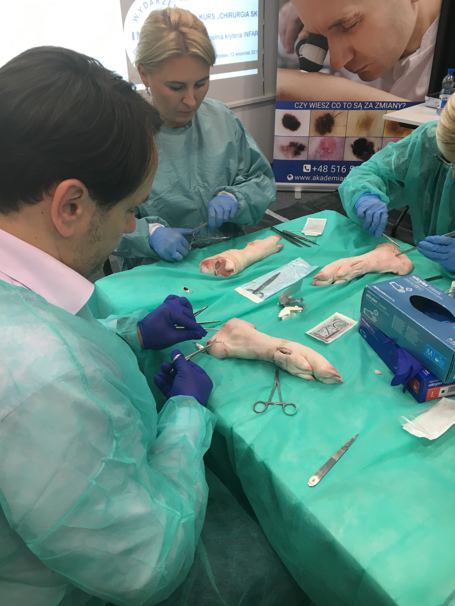
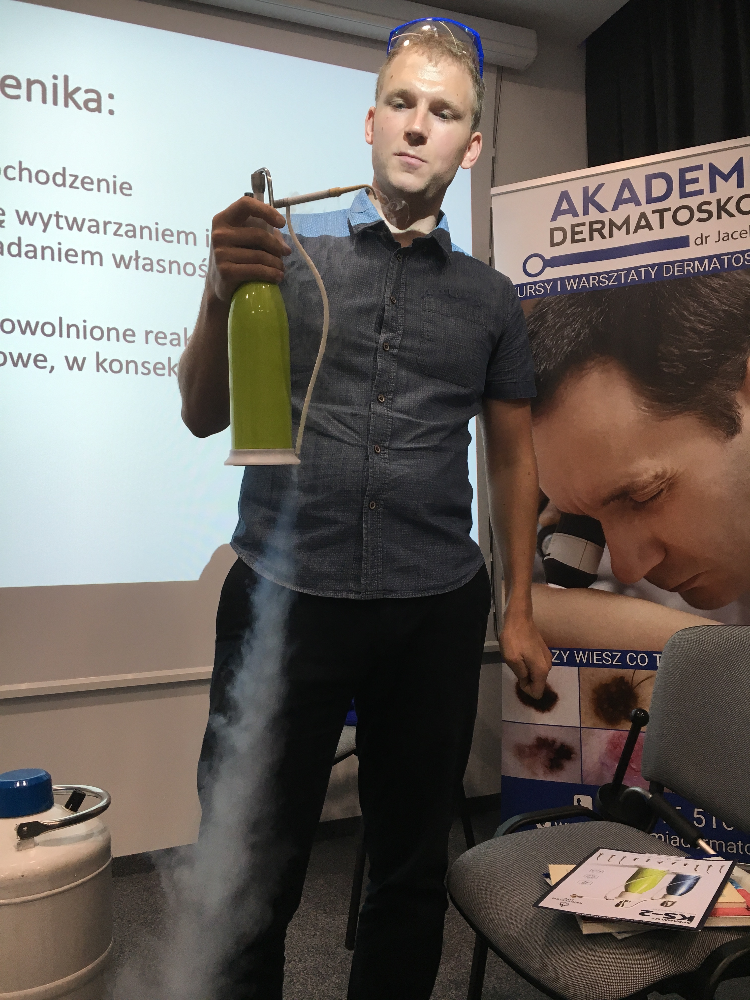
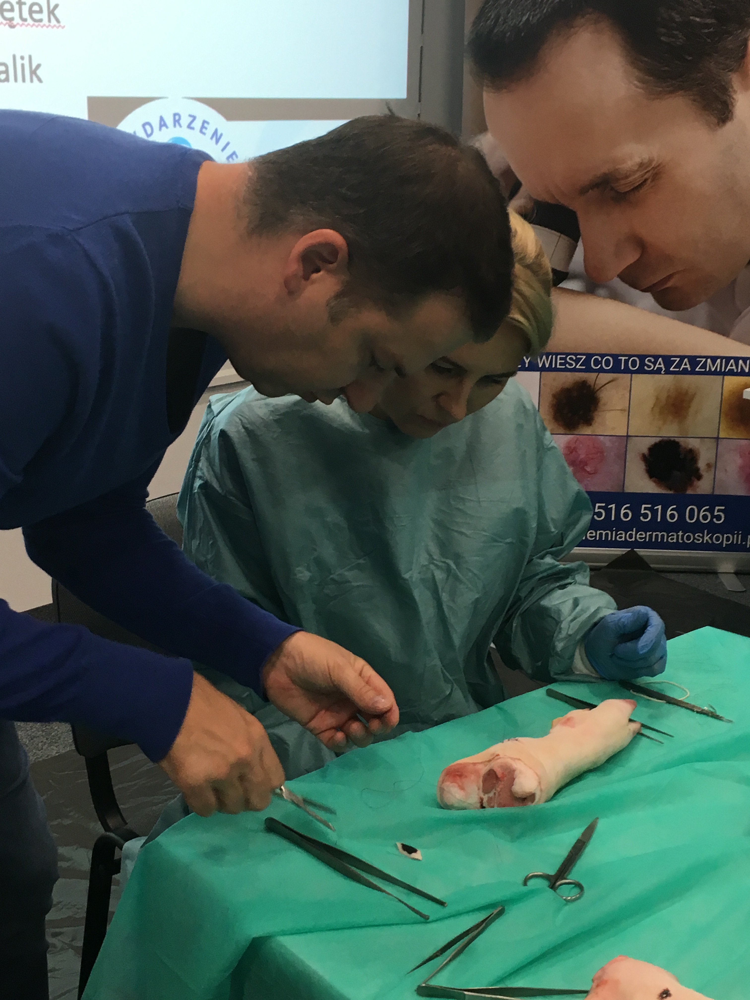
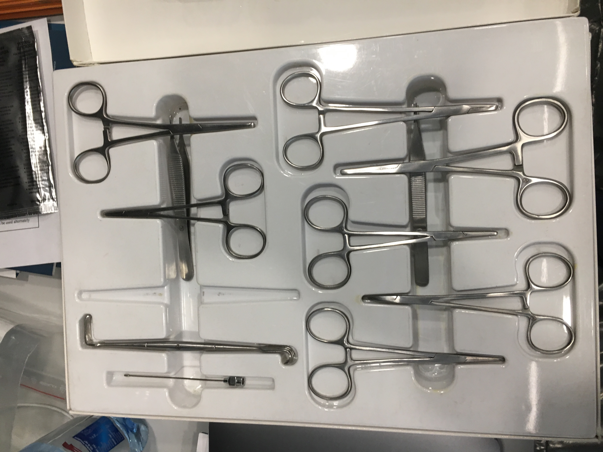
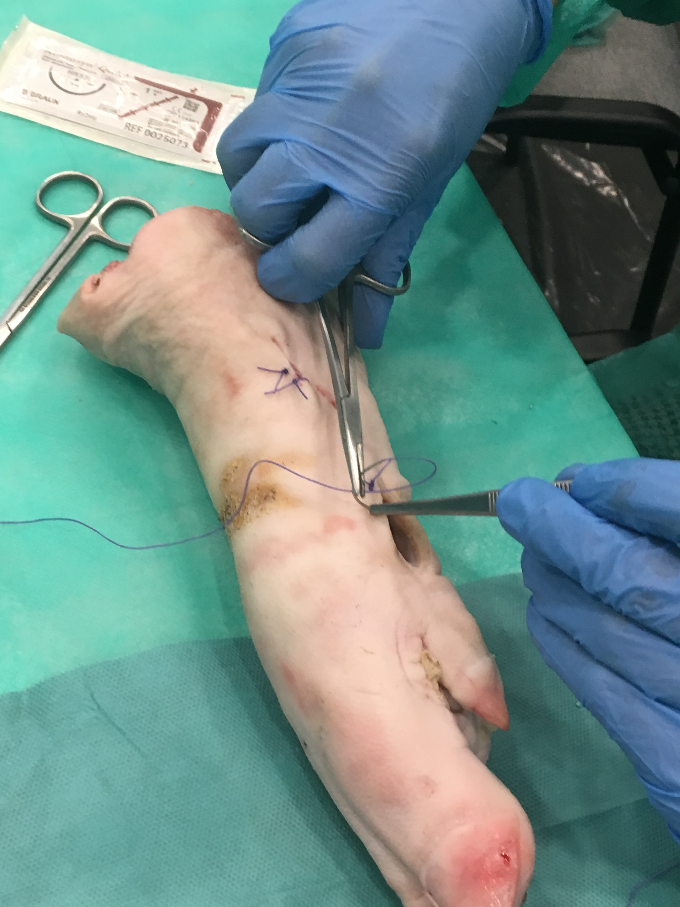
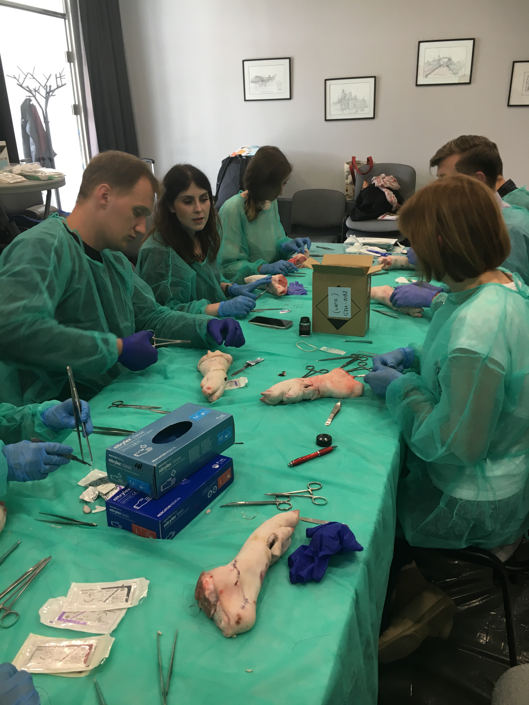
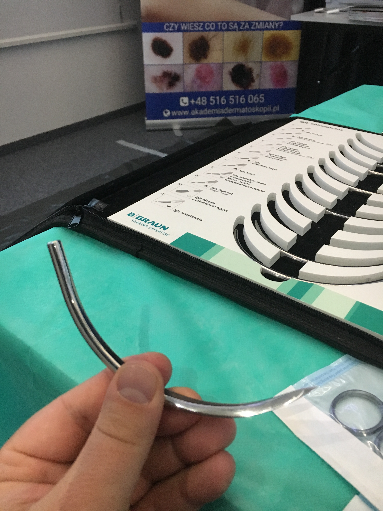
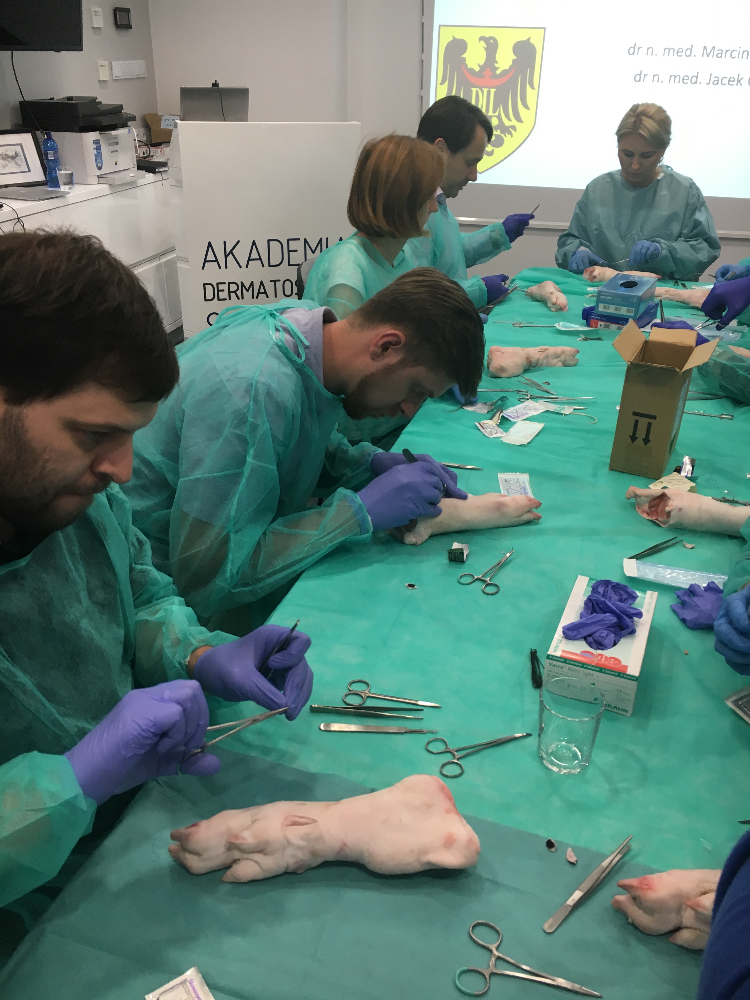
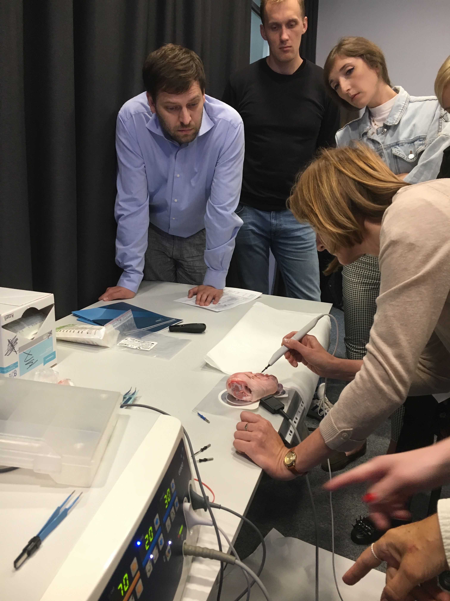

13-14.09.2019 we Wrocławiu w Akademii Dermatoskopii odbył się kurs z chirurgii skóry. Bardzo dziękuję uczestnikom oraz wykładowcom. Fantastyczne tematy, zajęcia praktyczne, konsultacje z inżynierami od sprzętu (kriochirurgia, elektrochirurgia, opatrunki i nici). Było fantastycznie ! Kawał dobrej wiedzy i praktyki.Zapraszamy na kolejne edycje.  

-   
    
-   
    
-   
    
-   
    
-   
    
-   
    
-   
    
-   
    
-   
