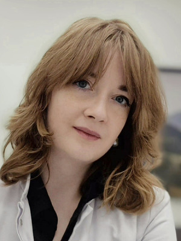

Dziś więcej o kolejnym warsztacie podczas VIII Konferencji Akademii Dermatoskopii!

Dziś więcej o kolejnym warsztacie podczas VIII Konferencji Akademii Dermatoskopii!

VIII Konferencja Akademii Dermatoskopii

Wrocław, Hotel Ibis Styles

5–6 września 2025

Lasery w dermatologii – fokus na laser CO₂

Chcesz rozpocząć pracę z laserem w swojej praktyce dermatologicznej? A może planujesz poszerzyć zakres oferowanych procedur laserowych?

To warsztat stworzony właśnie dla Ciebie!

Podczas VIII Konferencji Akademii Dermatoskopii zapraszamy na praktyczne i eksperckie warsztaty poświęcone wykorzystaniu lasera CO₂ w dermatologii – jednej z najczęściej stosowanych i najbardziej wszechstronnych technologii laserowych w dermatologii klinicznej i estetycznej.

Prowadząca warsztat:

dr n. med. Anna Słomiak-Wąsik – doświadczona lekarka, ekspertka w pracy z laserami dermatologicznymi, ceniona wykładowczyni i praktyk z wieloletnim doświadczeniem klinicznym.

Czego się nauczysz?

Podstaw fizyki i zasad działania lasera CO₂

Bezpiecznych i skutecznych technik pracy na skórze

Praktycznego zastosowania lasera w usuwaniu zmian skórnych, blizn, brodawek czy zmian przednowotworowych

Wskazań, przeciwwskazań oraz zasad kwalifikacji pacjenta

Doboru parametrów i zasad postępowania po zabiegu

Dla kogo?

Warsztat szczególnie polecamy:

• lekarzom rozpoczynającym pracę z laserami,

• osobom planującym wdrożenie nowego sprzętu do gabinetu,

• praktykom chcącym poszerzyć zakres zabiegów i działać z jeszcze większą pewnością.

\_\_\_\_\_\_\_\_\_\_\_\_\_\_\_\_\_\_\_\_\_\_\_\_\_\_\_\_\_\_\_\_\_\_\_\_\_\_\_\_

Zarezerwuj swoje miejsce już teraz – liczba miejsc ograniczona!

Nie przegap szansy na zdobycie wiedzy praktycznej, która przełoży się na realną zmianę w Twojej codziennej pracy z pacjentami!

VIII Konferencja Akademii Dermatoskopii

Wrocław, Hotel Ibis Styles

5–6 września 2025

Rejestracja: [mp.pl/dermatoskopia2025](http://mp.pl/dermatoskopia2025?fbclid=IwZXh0bgNhZW0CMTAAYnJpZBEwZTNBZ3R3eUJoWlNYeDd0egEeLAXvdakfalMC4c2PIUX2TQ3orcN55W-QgeY4eClWto7zGWFO7NTA_AiSnNo_aem_5bX0aKTTezyIpGG_d5a6Cg)

