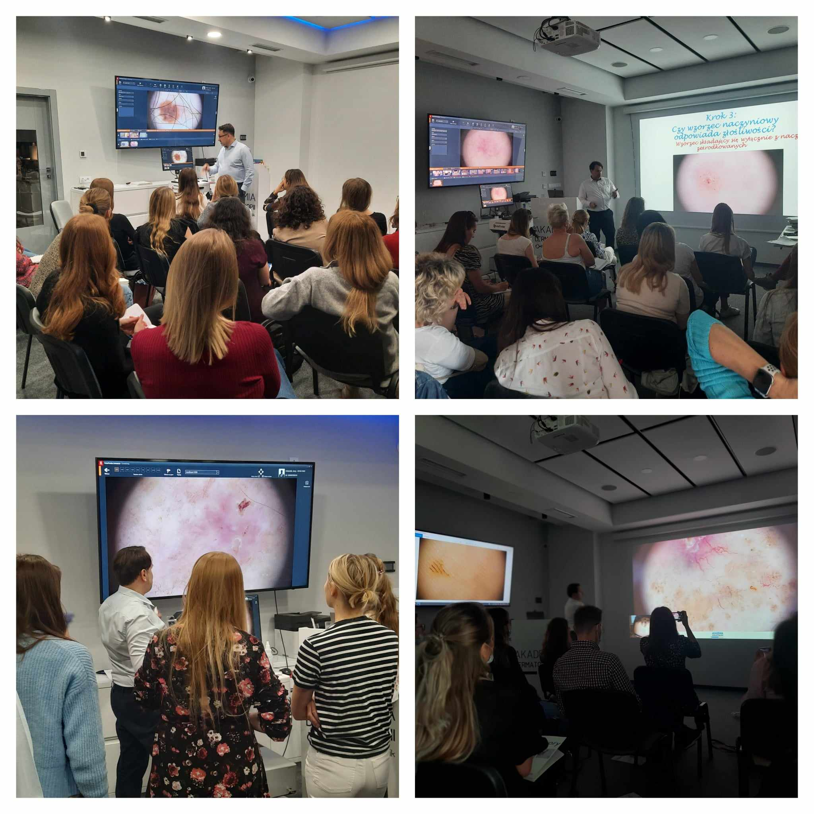

Mamy jeszcze kilka wolnych miejsc podczas kursu dermatoskopowego na poziome podstawowym!

Termin: 23-24.02.2024

Prowadzący: dr n.med. Jacek Calik

Prowadzący: dr n.med. Jacek Calik

Agenda kursu dostępna na stronie: [https://akademiadermatoskopii.pl/kursy/](https://akademiadermatoskopii.pl/kursy/?fbclid=IwAR2hCmbydLdG93RXzSPklS3JbpaOpMhoLqkJ2wtGQIpWI8i2qhCvpHU2FSY)

Zapisy niezmiennie: 516 516 065 lub kontakt@akademiadermatoskopii.pl

Do zobaczenia!

