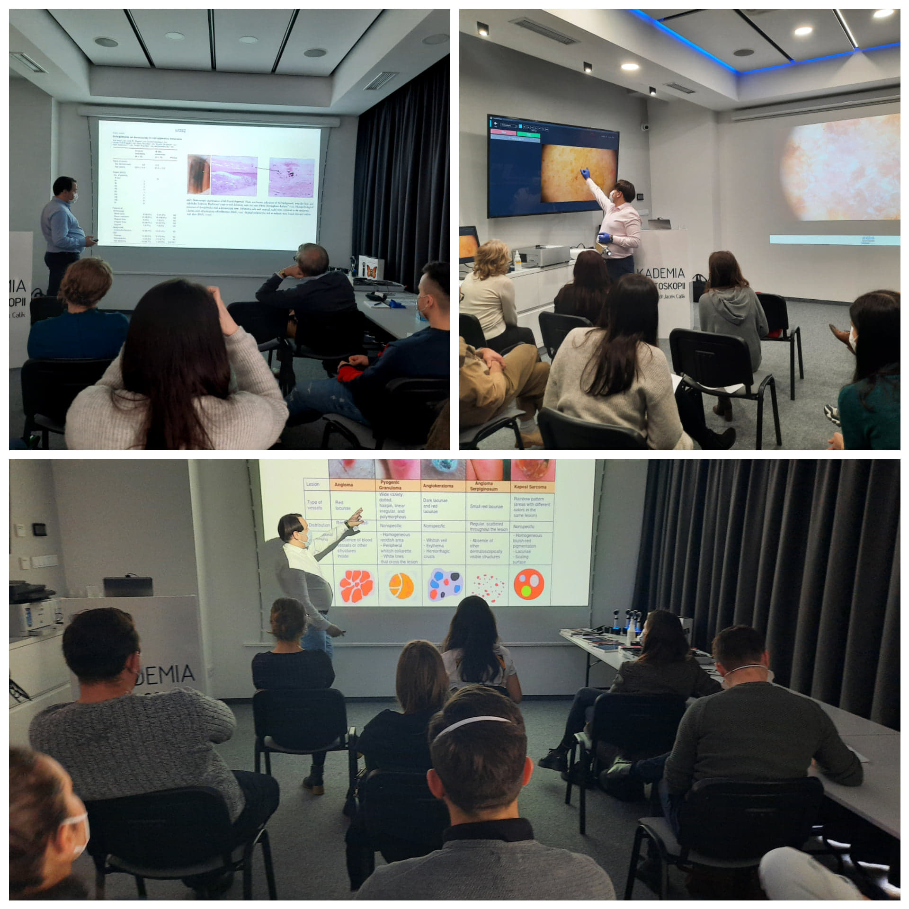

-   Wrocław 08-09.01.2021 Kurs Chirurgia Skóry
-   Wrocław 15-16.01.2021 Kurs dermatoskopowy podstawowy
-   Wrocław 19-20.02.2021 Kurs dermatoskopowy podstawowy
-   Wrocław 19-20.03.2021 Kurs dermatoskopowy podstawowy
-   Wrocław 23-24.04.2021 Kurs dermatoskopowy zaawansowany
-   Wrocław 21-22.05.2021 Kurs Chirurgia Skóry
-   Wrocław 28-29.05.2021 Kurs dermatoskopowy podstawowy
-   Wrocław 20-21.08.2021 Kurs dermatoskopowy podstawowy
-   Wrocław 24-25.09.2021 Kurs dermatoskopowy zaawansowany
-   Wrocław 01-02.10.2021 Kurs dermatoskopowy podstawowy
-   Wrocław 26-27.11.2021 Kurs dermatoskopowy podstawowy
-   Wrocław 10-11.12.2021 Kurs dermatoskopowy podstawowy

Zapraszamy do zapisów przez stronę [https://akademiadermatoskopii.pl/kontakt/](https://akademiadermatoskopii.pl/kontakt/?fbclid=IwAR3A0lzAiPW6_NEINbLcsCtPFWe67x_W0e9dB9XoQIUoQQuoYyjlyTJKq9g) lub do kontaktu telefonicznego 516-516-065

