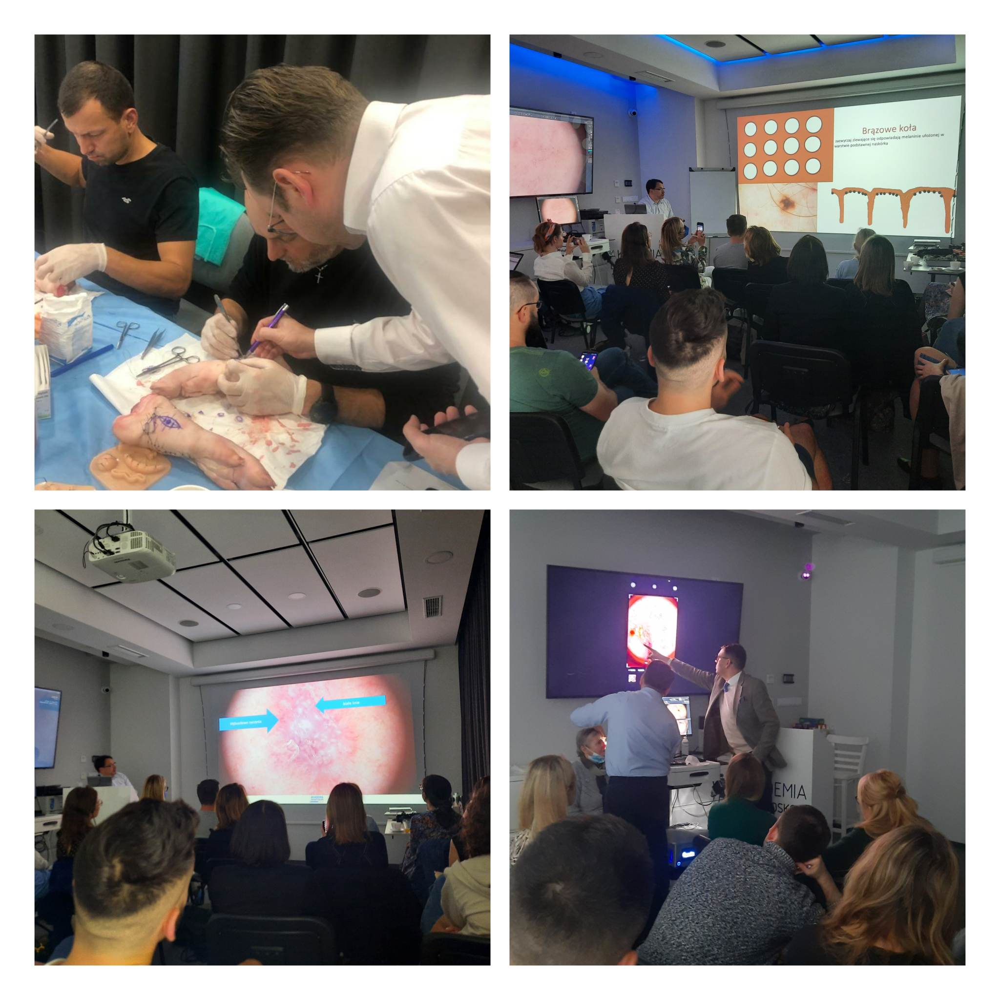

Wrocław, 27-28.01.2023  Kurs dermatoskopowy podstawowy

Wrocław, 04.02.2023 Kurs Chirurgia Skóry (Intensywne warsztaty praktyczne, kurs jednodniowy)

Wrocław, 10-11.03.2023 Kurs dermatoskopowy podstawowy

Wrocław, 24-25.03.2023 Kurs dermatoskopowy zaawansowany

Wrocław, 15.04.2023 Kurs Chirurgia Skóry (Intensywne warsztaty praktyczne, kurs jednodniowy)

Wrocław, 28-29.04.2023 Kurs dermatoskopowy podstawowy

Wrocław, 19-20.05.2023 Kurs dermatoskopowy podstawowy

Wrocław, 16-17.06.2023 Kurs dermatoskopowy podstawowy

Wrocław, 24.06.2023 Kurs Chirurgia Skóry (Intensywne warsztaty praktyczne, kurs jednodniowy)

Zapraszamy do zapisów przez stronę [https://akademiadermatoskopii.pl/kontakt/](https://akademiadermatoskopii.pl/kontakt/?fbclid=IwAR3jkWSyst4t-Bn3ljk-ly9lxkU05XV_8hfM_CkD3NQqneyugDGfZrGyfk4) lub do kontaktu telefonicznego 516-516-065

