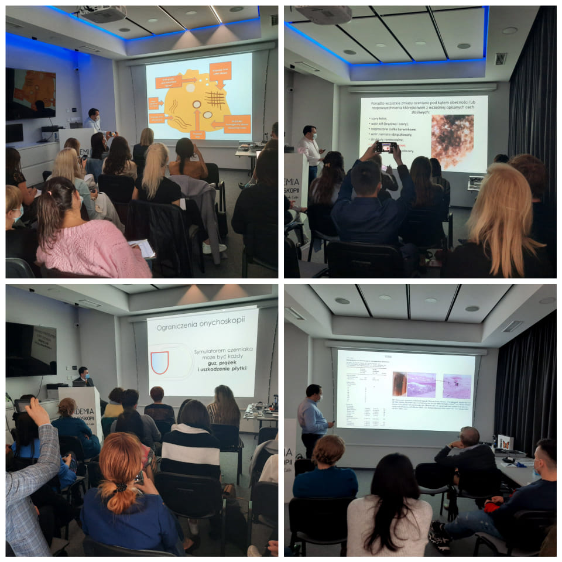

W związku z licznymi zapytaniami dotyczącymi terminu kolejengo kursu dermatoskopowego na poziomie zaawansowanym, informujemy, że kurs odbędzie się w terminie 12-13.11.2021

Zakres szkolenia:

-   Nowe trendy w diagnostyce nowotworów skóry
-   Chaos i Wzory – dermatoskopowy algorytm dla zmian barwnikowych
-   Przewidywanie bez barwnika – dermatoskopowy algorytm dla zmian bezbarwnikowych
-   SKINTEST przypadki kliniczne
-   Czerniaki skóry twarzy
-   Czerniaki podpaznokciowe
-   Znamiona barwnikowe wrodzone i szczególne typy znamion
-   Guzy keratynocytowe. Model progresji SCC
-   Dermatoskopia w rzadkich nowotworach skóry
-   Przypadki interaktywne z omówieniem
-   Inflamoskopia
-   Zmiany spitzoidalne
-   Czerniaki akralne

Zapraszamy do zapisów przez stronę [https://akademiadermatoskopii.pl/kontakt/](https://akademiadermatoskopii.pl/kontakt/?fbclid=IwAR3PzH3maPVBCVkfJEKbepWd59INk9xKqq8jTYTOMdglmQdyrLp9ddYc2F0) lub do kontaktu telefonicznego 516-516-065.

Do zobaczenia!

