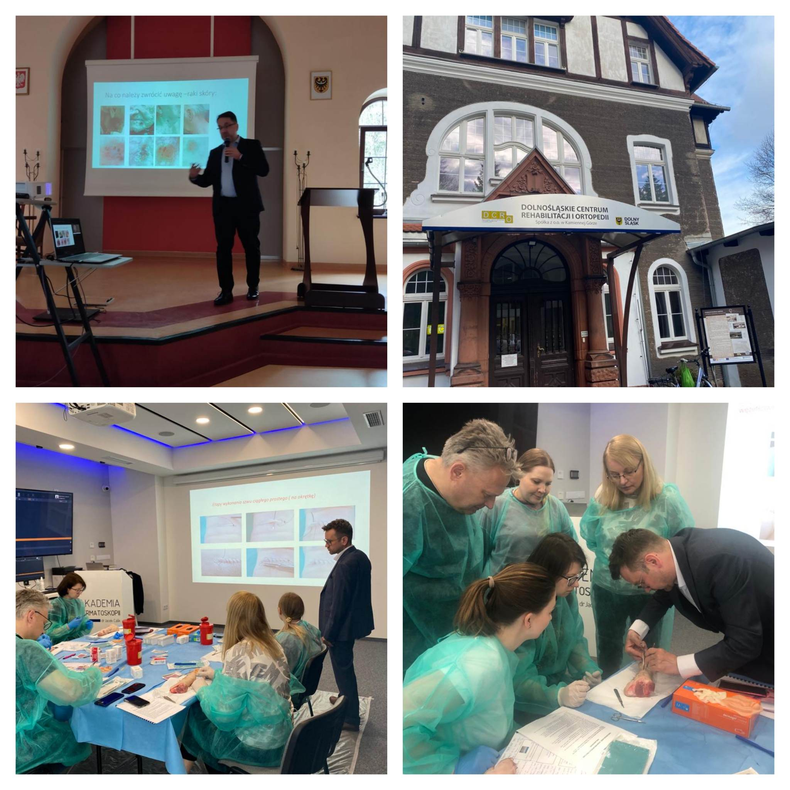

Miniony weekend w Akademii Dermatoskopii był niezwykle aktywny! A to za sprawą aż dwóch wydarzeń!  
W Kamiennej Górze odbyło się spotkanie edukacyjno-profilaktyczne poświęcone schorzeniom skórnym i urologicznym wraz z bezpłatnymi badaniami. Podczad wykładu Skóra mocno opalona? Zwróć uwagę na znamiona dr n. med. Jacek Calik przbliżył zagdanienia dotyczące raków i czerniaków skóry, zbadał także sporą liczbę Pacjentów! Dziękujemy organizatorom za krzewienie zdrowych nawyków i świadomości wśród mieszkańców jak ważna jest profilatyka!  
W weekend w Akademii Dermatoskopii odbył się także kurs z Chirurgii skóry, który poprowadził niezmiennie dr n. med. Marek Łuciuk. Wycinaniu zmian i szyciu nie było końca! Wykład dotyczący przydatności dermatoskopii w chirurgii wygłosił dr n. med. Jacek Calik! Dziękujemy lekarzom za zaangażowanie i aktywny udział!  
Kolejny kurs z Chirurgii skóry już 24.06.2023  
Zapisy: kontakt@akademiadermatoskopii.pl lub 516-516-065  
Do zobaczenia!

