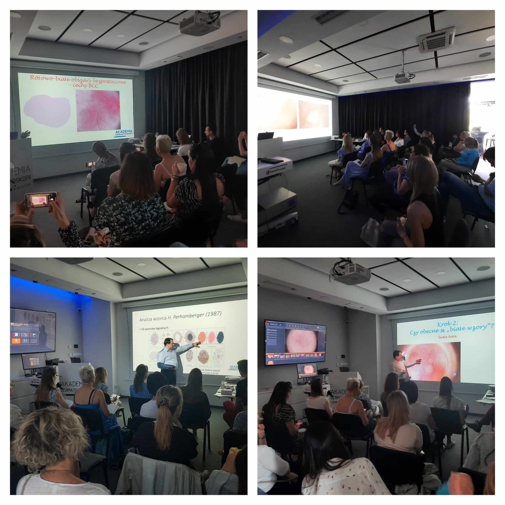

Nie słabnie zainteresowanie zapisami na kursy dermatoskopowe.

Dlatego informujemy, że najbliższy termin, gdzie zostało nam jeszcze kilka wolnych miejsc to 17-18.05.2024  
Termin: 17-18.05.2024  
Prowadzący: dr n.med. Jacek Calik  
Agenda kursu dostępna na stronie: [https://akademiadermatoskopii.pl/kursy/](https://akademiadermatoskopii.pl/kursy/)  
Zapisy: 516 516 065, kontakt@akademiadermatoskopii.pl lub przez formularz rejestracyjny zamieszczony na stronie [https://akademiadermatoskopii.pl/kursy/](https://akademiadermatoskopii.pl/kursy/)  
Do zobaczenia!

