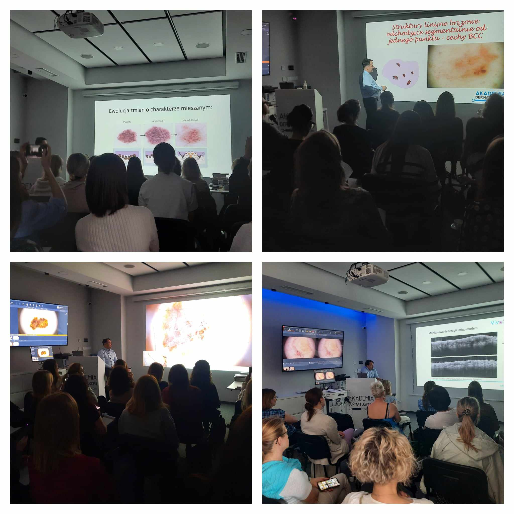

Nie słabnie zainteresowanie zapisami na kursy dermatoskopowe!

Dlatego informujemy, że najbliższy termin, gdzie zostało nam jeszcze kilka wolnych miejsc to 22-23.03.2024  
Prowadzący: dr n.med. Jacek Calik  
Agenda kursu dostępna na stronie: [https://akademiadermatoskopii.pl/kursy/](https://akademiadermatoskopii.pl/kursy/)  
Zapisy niezmiennie: 516 516 065 lub kontakt@akademiadermatoskopii.pl  
Do zobaczenia!

