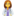
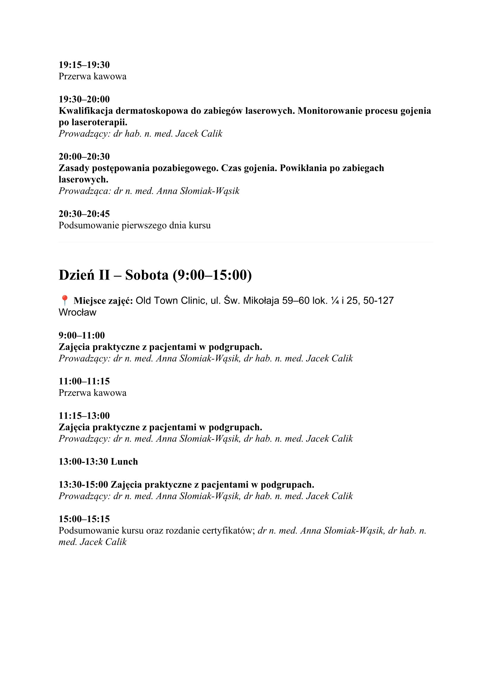

Nowość w Akademii Dermatoskopii!

Kurs Laser CO2 – teoria i praktyka

Prowadzący: dr n. med. Anna Słomiak-Wąsik i dr hab. n. med. Jacek Calik 

Termin: 5-6 czerwca 2026

Miejsce: Dzień I Akademia Dermatoskopii ul. Wybrzeże Stanisława Wyspiańskiego 11, Wrocław

Miejsce: Dzień II: Przychodnia Old Town Clinic ul. św. Mikołaja 59-60 lok. 1/4 i 25, Wrocław

Zapisy możliwe na 3 sposoby: poprzez formularz rejestracyjny

[https://akademiadermatoskopii.pl/kursy/](https://akademiadermatoskopii.pl/kursy/?fbclid=IwZXh0bgNhZW0CMTAAYnJpZBEwblRqbXB3V2tOU2NnMXlyWnNydGMGYXBwX2lkEDIyMjAzOTE3ODgyMDA4OTIAAR4M0X90CwVuGVubP5aB0ZZqhl9GaPGRc1BtAKzmcEDmblYZOxYJOEGT1svD-A_aem_fcAygnhZhJCIIlp-tuus-g) telefonicznie: 516-516-065 lub mailowo: kontakt@akademiadermatoskopii.pl

Do zobaczenia!

