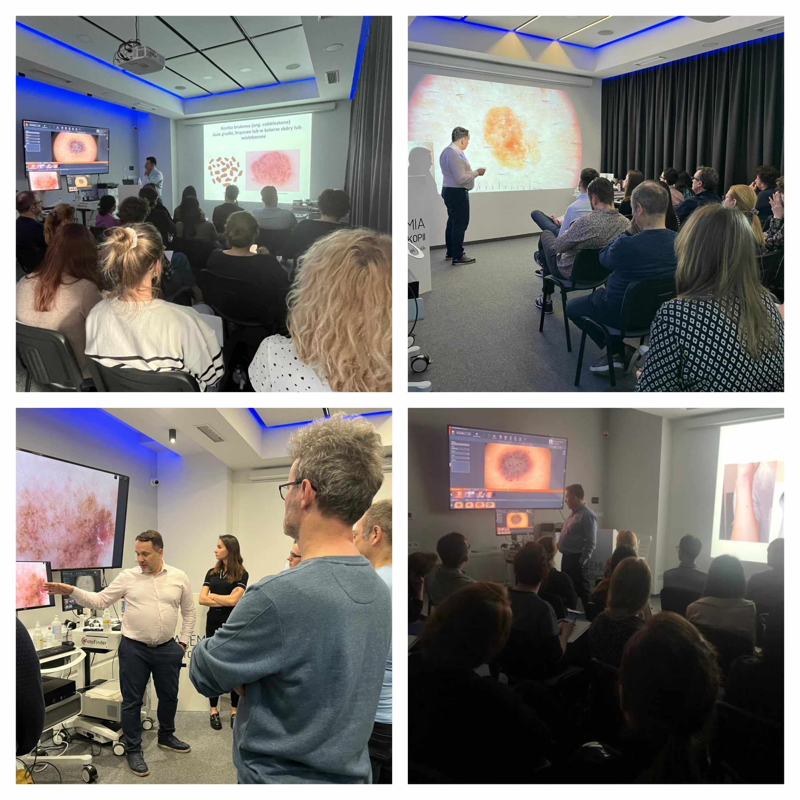

Przed nami ostatni przed wakacyjną przerwą kurs dermatoskopowy na poziomie podstawowym!  
Zostalo nam zaledwie kilka wolnych miejsc!  
Termin: 14-15.06.2024  
Prowadzący: dr n. med. Jacek Calik  
Zapisy możliwe na 3 sposoby: poprzez formularz rejestracyjny dostępny na stronie [https://akademiadermatoskopii.pl/kursy/](https://akademiadermatoskopii.pl/kursy/) telefonicznie: 516-516-065 lub mailowo: kontakt@akademiadermatoskopii.pl  
Do zobaczenia!

