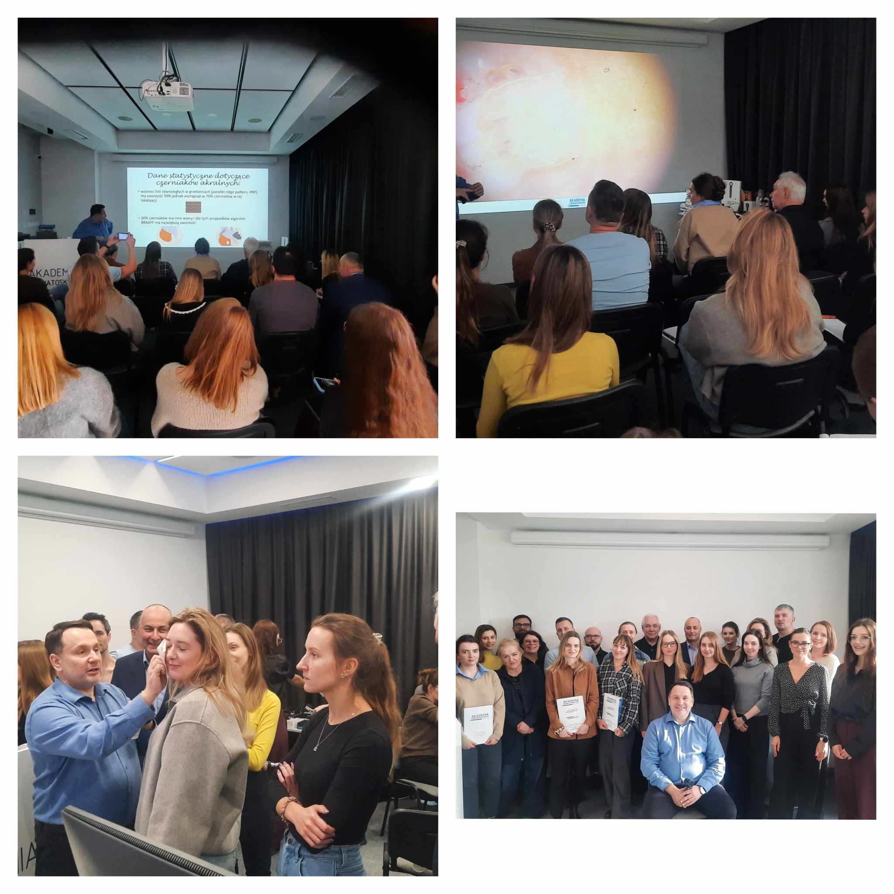

Piątek i sobota w Akademi Dermatoskopii były pełne analizy wielu obrazów dermatoskopowych i nauki!

A to wszystko za sprawą kursu dermatoskopowego na poziomie podstawowym!

Dziękujemy uczestniczącym lekarzom za zaangażowanie, chęć poszerzania swojej wiedzy i aktywne uczestnictwo!

Wszystkich, którzy chcieliby usystematyzować swoją wiedzę w zakresie dermatoskopii zapraszamy do zapisów!

Już za tydzień kurs dermatoskopowy zaawansowany!

21-22.03.2025

Zapisy możliwe na 3 sposoby: poprzez formularz rejestracyjny dostępny na stronie [https://akademiadermatoskopii.pl/kursy/](https://akademiadermatoskopii.pl/kursy/?fbclid=IwZXh0bgNhZW0CMTAAAR3PfyPHsXt3FAghBCOJXT4zLwl9FfLCoqVlXzr7CtlI1P_9d_ys-9oyDXQ_aem_ZbauMbuX4Ug6g0Luh_Z_JA) telefonicznie: 516-516-065 lub mailowo: kontakt@akademiadermatoskopii.pl

Do zobaczenia!

