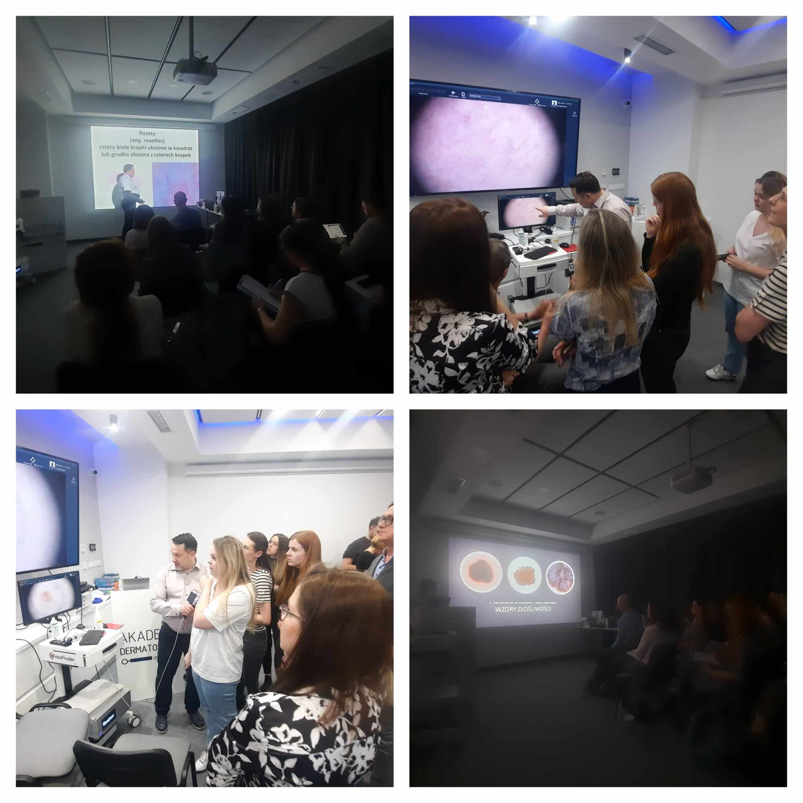

Piatek i sobota w Akademi Dermatoskopii były pełne nauki, analizy wielu obrazów dermatoskopowych i badań! A to wszystko za sprawą kursu dermatoskopowego na poziomie podstawowym!

Dziękujemy uczestniczącym lekarzom za zaangażowanie, chęć poszerzania swojej wiedzy i aktywne uczestnictwo!

Wszystkich, którzy chcieliby usystematyzować swoją wiedzę w zakresie dermatoskopii zapraszamy w terminie:

22-23.03.2024

Prowadzący: dr n.med. Jacek Calik

Zapisy niezmiennie: 516-516-065 lub kontakt@akademiadermatoskopii.pl

Do zobaczenia!

