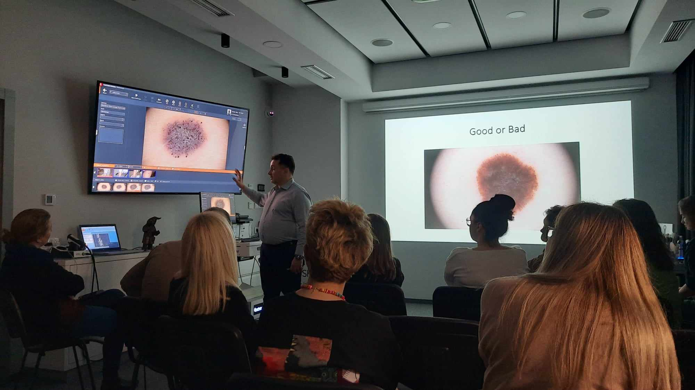
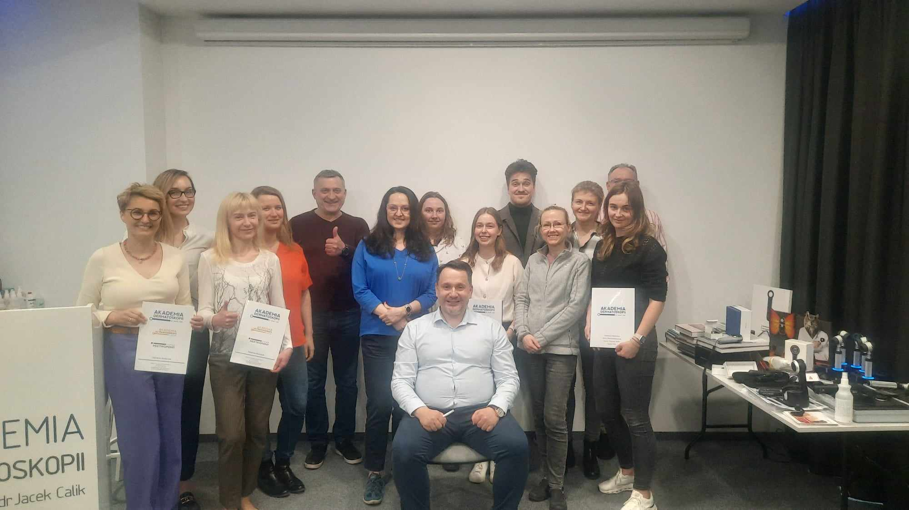
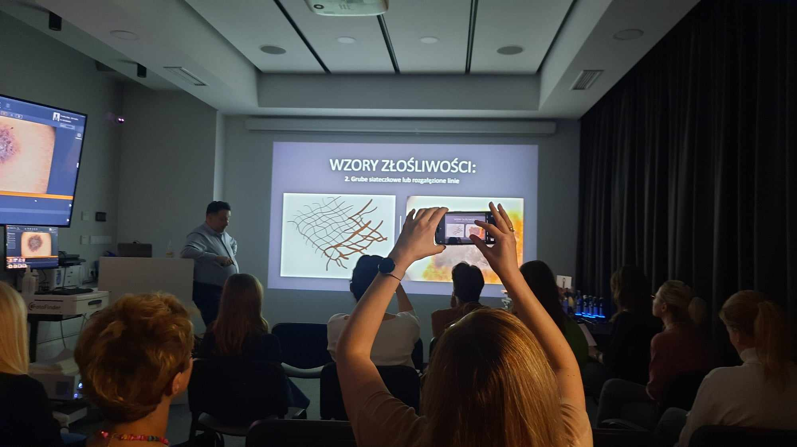
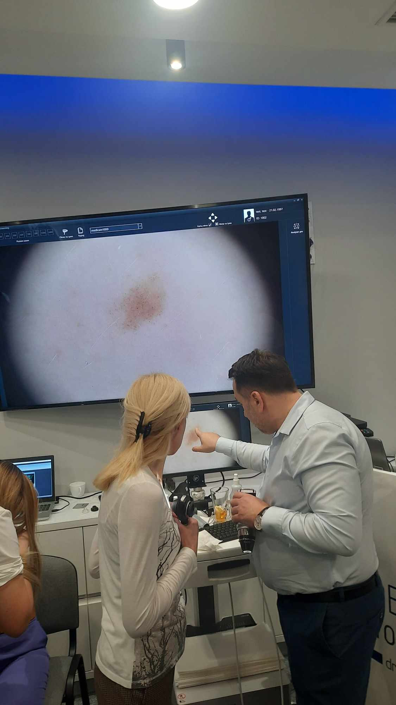

Piatek i sobota w Akademi Dermatoskopii były pełne nauki, analizy wielu obrazów dermatoskopowych i badań!

A to wszystko za sprawą kursu dermatoskopowego na poziomie podstawowym!

Dziękujemy uczestniczącym lekarzom za zaangażowanie, chęć poszerzania swojej wiedzy i aktywne uczestnictwo!

Wszystkich, którzy chcieliby usystematyzować swoją wiedzę w zakresie dermatoskopii zapraszamy w kolejnych terminach:

26-27.04.2024

17-18.05.2024

14-15.06.2024

Prowadzący: dr n.med. Jacek Calik

Zapisy możliwe na 3 sposoby: poprzez formularz rejestracyjny dostępny na stronie [https://akademiadermatoskopii.pl/kursy/](https://akademiadermatoskopii.pl/kursy/?fbclid=IwAR30-8kzZ8DdFSCI-GMIfg5gRZqWnGih4QlYHj-xe-2AjO1LakGHE6i7jX4) telefonicznie: 516-516-065 lub mailowo: kontakt@akademiadermatoskopii.pl

Do zobaczenia!

