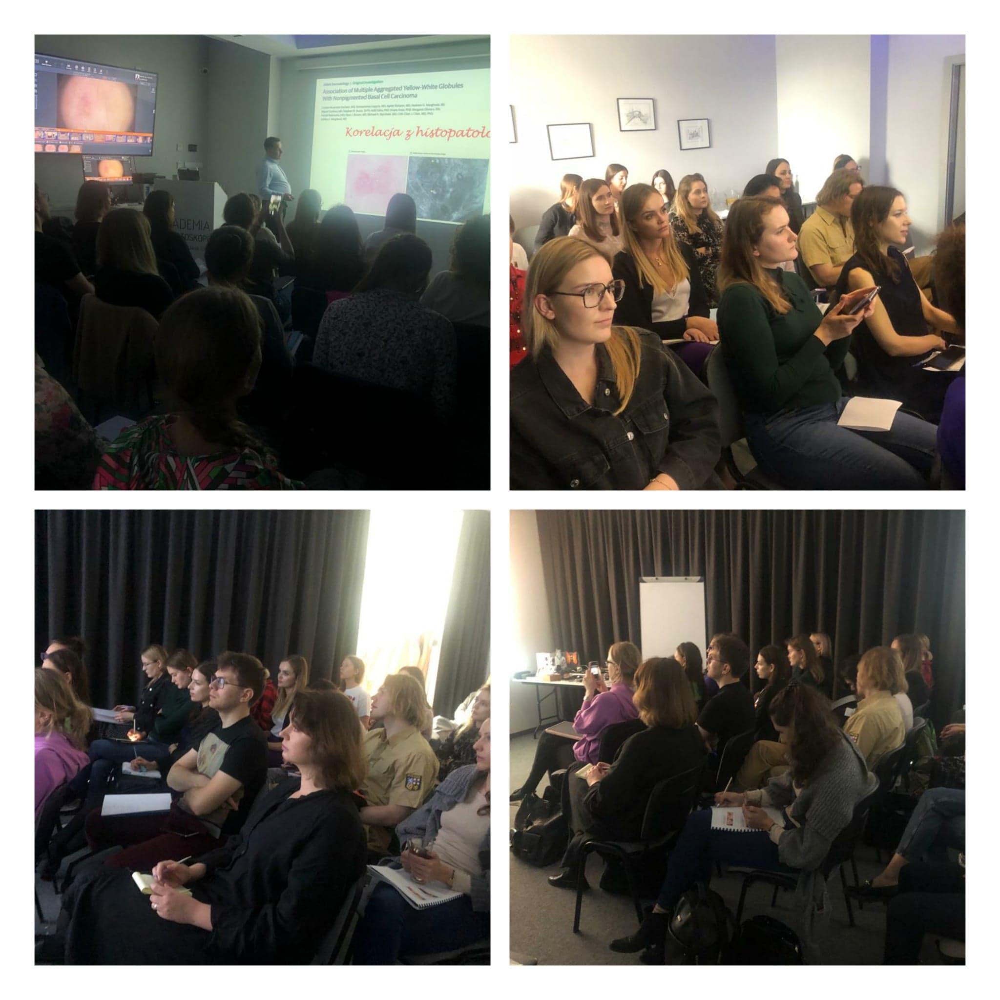

Piątek i sobota w Akademii Dermatoskopii były bardzo aktywne, a to wszytsko dzięki zaanagażowaniu lekarzy biorących udział w kolejnym kursie dermatoskopowym na poziomie podstawowym.

Kierownikiem naukowym i prowadzącym kurs jak zawsze był dr n. med. Jacek Calik

Dziękujemy za 2 dni pełne nauki i za Państwa aktywność!

Na kolejny kurs dermatoskopowy na poziomie podstawowym zapraszamy w terminie 9-10 grudnia!

Zostało jeszcze kilka wolny miejsc!

Zapisy: kontakt@akademiadermatoskopii.pl lub pod numerem telefonu: +48 71 710 6834

Do zobaczenia!

