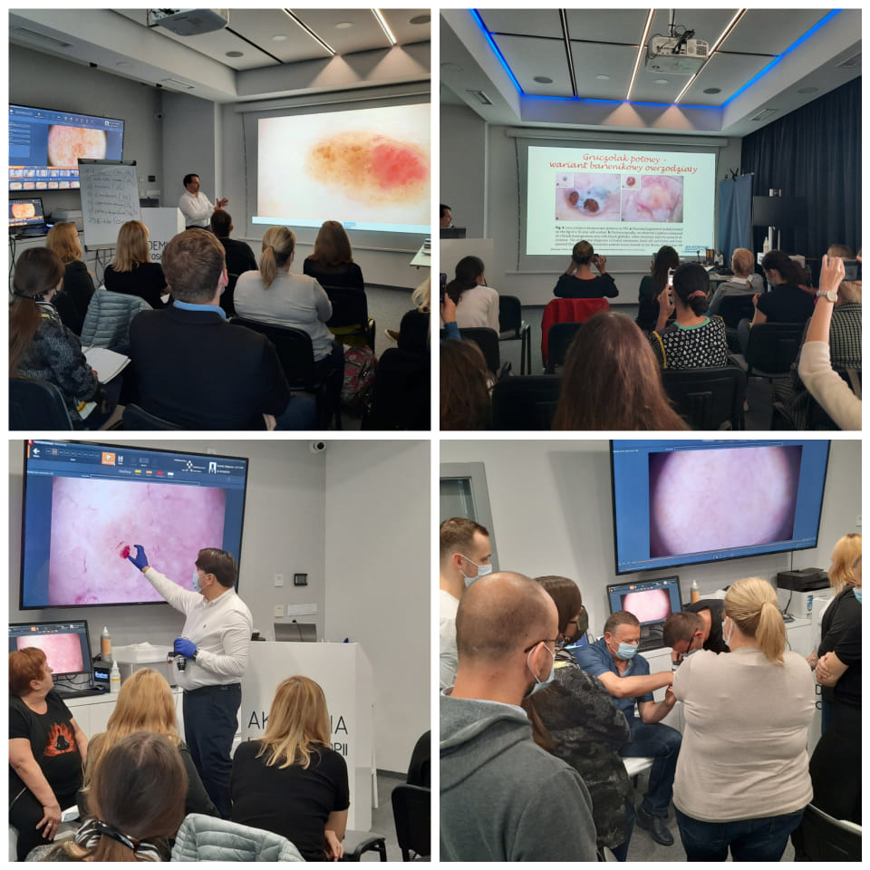

Piątek i sobota w Akademii Dermatoskopii były bardzo aktywne, a to wszytsko dzięki zaanagażowaniu lekarzy biorących udział w kolejnym kursie dermatoskopowym na poziomie podstawowym. Kierownikiem naukowym i prowadzącym kurs jak zawsze był dr n. med. Jacek Calik. Dziękujemy za 2 dni pełne nauki i za Państwa aktywność!Niezmiennie zapraszamy na kursy – najbliższy z Chirurgi Skóry odbędzie się w terminie 5-6.11.2021! Zapraszamy do zapisów 516-516-065

-   
