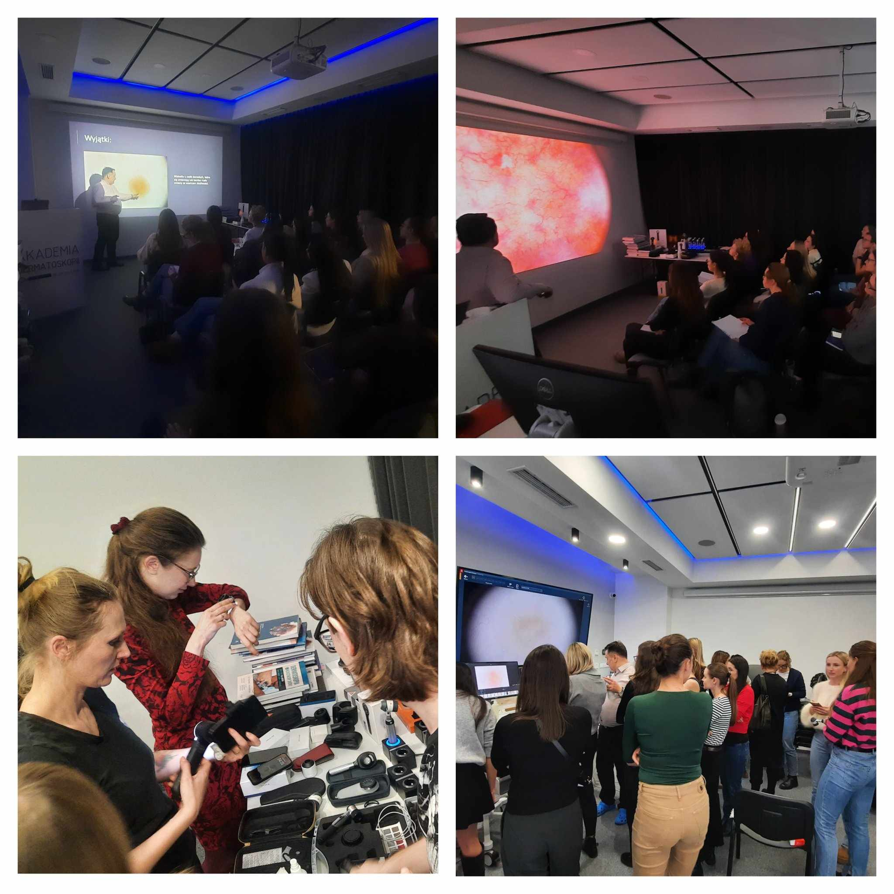

Piątek i sobota w Akademii Dermatoskopii były bardzo pracowite, a to za sprawą odbywającego sie kursu dermatoskopowego na poziomie podstawowym!

Duża wiedza uczestników i zaangażowanie pozwoliły na merytoryczną wymianę doświedczeń!

Dziękujemy za Państwa aktywne uczestnictwo!

Zapraszamy do zapisów na kursy podstawowe w terminiach:

Wrocław, 14-15.03.2025 Kurs dermatoskopowy podstawowy

Wrocław, 16-17.05.2025 Kurs dermatoskopowy podstawowy

Przed nami także kurs dermatoskopowy na poziomie zaawansowanym!

Zapraszamy w terminie 21-22.03.2025!

Zapisy możliwe na 3 sposoby: poprzez formularz rejestracyjny

dostępny na stronie [https://akademiadermatoskopii.pl/kursy/](https://akademiadermatoskopii.pl/kursy/?fbclid=IwZXh0bgNhZW0CMTAAAR38Nq42cqSzbeX2n12xE9791fGoAyAxWKGgjIQ6inWl8GRB8A0DpH1RSs8_aem_TbnYTTYe8R_E5JlXW_dvzw) telefonicznie: 516-516-065 lub mailowo: kontakt@akademiadermatoskopii.pl

Do zobaczenia!

