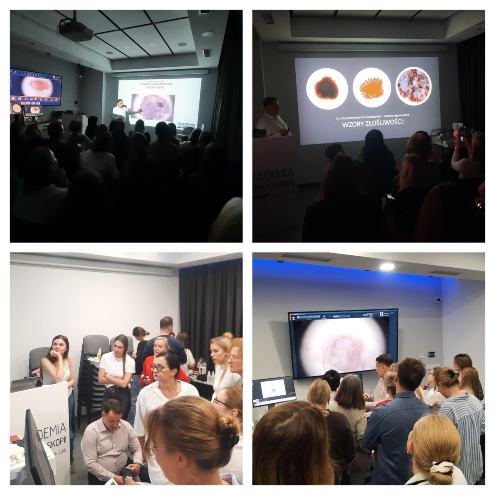

Piątek i sobota w Akademii Dermatoskopii były pełne obrazów dermatoskopowych i nauki!

A to wszystko to za sprawą odbywającego się kursu dermatoskopwego na poziomie podstawym!

Dziękujemy za Państwa zaangażowanie, wnikliwą analizę i chęć poszerzania swojej wiedzy!

Na kolejny kurs dermatoskopowy podstawowy zapraszamy po wakacjach!

Termin 26-27.09.2025

Zapisy możliwe na 3 sposoby: poprzez formularz rejestracyjny dostępny na stronie [https://akademiadermatoskopii.pl/kursy/](https://akademiadermatoskopii.pl/kursy/?fbclid=IwZXh0bgNhZW0CMTAAYnJpZBEwMmQzV3hiUk1TN2V5U2M5bwEeSlpKiDMkSq-5FjHL4yKr4yEs-kLgdIWSWstH1_1kTrrPgU1fiwEEqeVlQqs_aem_iFSmHFs1Ro1gXktpOZfcrw) telefonicznie: 516-516-065 lub mailowo: kontakt@akademiadermatoskopii.pl

Do zobaczenia!

