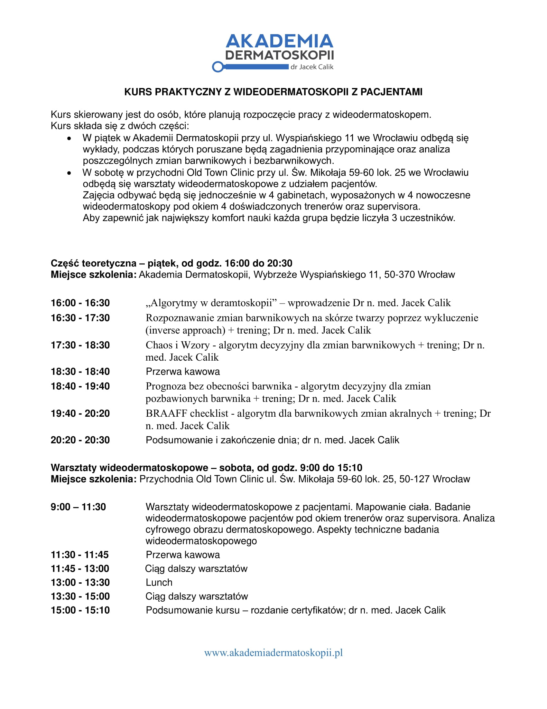

Pierwszy raz w Akademii Dermatoskopii kurs skierowany do osób rozpoczynających pracę z wideodermatoskopem!

Zostało jedynie kilka wolnych miejsc!

Termin: 4-5.11.2022!

Kurs składa się z dwóch części:

• W piątek w Akademii Dermatoskopii przy ul. Wyspiańskiego 11 we Wrocławiu odbędą się wykłady, podczas których poruszane będą zagadnienia przypominające oraz analiza poszczególnych zmian barwnikowych i bezbarwnikowych.

• W sobotę w przychodni Old Town Clinic przy ul. Św. Mikołaja 59-60 lok. 25 we Wrocławiu odbędą się warsztaty wideodermatoskopowe z udziałem pacjentów.

Zajęcia odbywać będą się jednocześnie w 4 gabinetach, wyposażonych w 4 nowoczesne wideodermatoskopy pod okiem 4 doświadczonych trenerów oraz supervisora.

Aby zapewnić jak największy komfort nauki każda grupa będzie liczyła 3 uczestników

Zapisy: kontakt@akademiadermatoskopii.pl lub +48 71 710 6834

Do zobaczenia!

