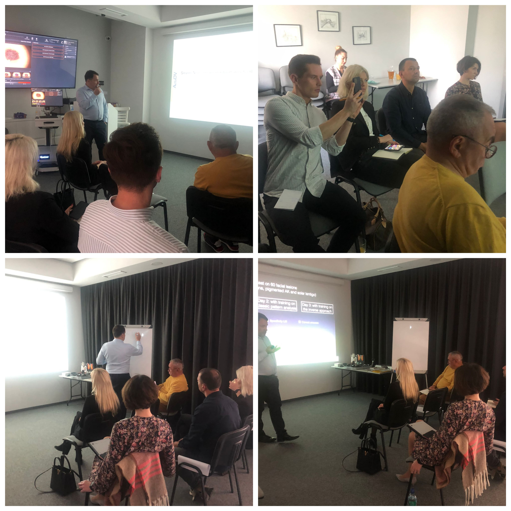

Pierwszy raz w Akademii Dermatoskopii odbył się kurs na poziomie średnio zaawansowanym!

Kursy na poziomie średnio zaawansowanym zwykle odbywały się w większych miastach Polski, by dermatoskopia mogła dotrzeć do jak największej liczby lekarzy

Dziękujemy lekarzom biorącym udział w sobotnim kursie za zaangażowanie i chęć nauki!

Kolejne edycje zapewne w przyszłym roku!

A tymczasem zapraszamy na kursy, które obdędą się jeszcze w tym roku!

Wrocław 14-15.10.2022 Kurs dermatoskopowy podstawowy

Wrocław 29.10.2022 Kurs trichoskopowy

Wrocław 04-05.11.2022 Kurs praktyczny z wideodermatoskopii z pacjentami (NOWOŚĆ)

Wrocław 19.11.2022 Kurs z chirurgii skóry (Intensywne warsztaty praktyczne-kurs jednodniowy)

Wrocław 25-26.11.2022 Kurs dermatoskopowy zaawansowany

Wrocław 09-10.12.2022 Kurs dermatoskopowy podstawowy

Zapisy: kontakt@akademiadermatoskopii.pl lub pod numerem telefonu: +48 71 710 6834

Do zobaczenia!

