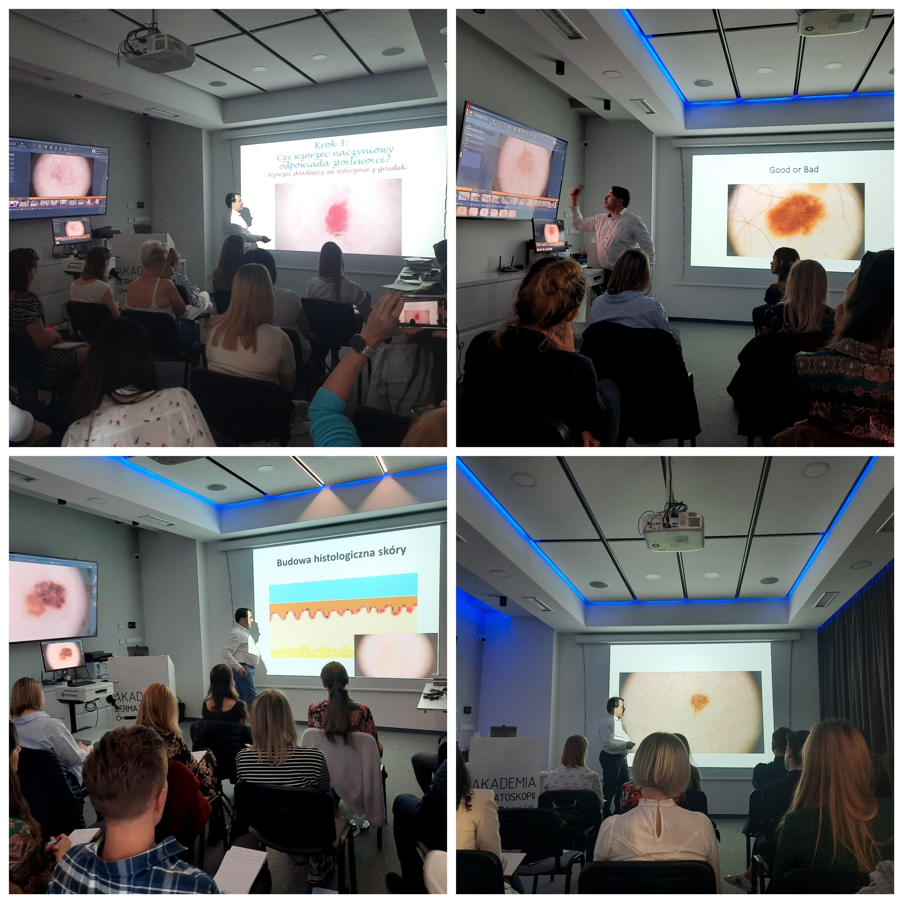

Pierwszy raz we Wrocławiu!

Przed nami pierwsza edycja kursu dermatoskopowego na poziomie średnio zaawansowanym, który odędzie się we Wrocławiu!

Termin: 01.10.2022

Miejsce: Akademia Dermatoskopii ul. Wyspiańskiego 11, Wrocław

Agenda kursu: [https://akademiadermatoskopii.pl/kursy](https://l.facebook.com/l.php?u=http%3A%2F%2Fakademiadermatoskopii.pl%2Fkursy%2F%3Ffbclid%3DIwAR1If3hYTT8oHZoYa5O2c1JNIVAoj561f4birVEaZgEKKSUMibXb-1V_Dy4&h=AT2lQfGPKQBAHlHT0EID40KAV22YRkiFr9uagSzu4gP-E6OGoYEW1hG5YCY9SxaYPCFqNX5L_suOydzeLP-CyPWGgQsYSYQfaMHWINBFelqPjMsk1QFEZZHXpsXwtcp9ExQa&__tn__=-UK-R&c[0]=AT0BpfDzbbpVLFMzfIImZv-gQ_xt1JHoSdz5vBF0wpsW7s4TlkInZkwnLZ7LHL9vQTVBm2GA9bNh84AX5d8WrrWs-ZKx8FwrR12PbHMbEDaFKBfdTJphkX0-Gsi1dhMXWgKpdcX5_k2D2tShs2lDe5Ma1g)

Kierownik naukowy i prowadzący kurs: dr n.med. Jacek Calik

Zostało już tylko kilka wolnych miejsc!

Zapisy: kontakt@akademiadermatoskopii.pl lub pod numerem telefonu: +48 71 710 6834

Do zobaczenia!

