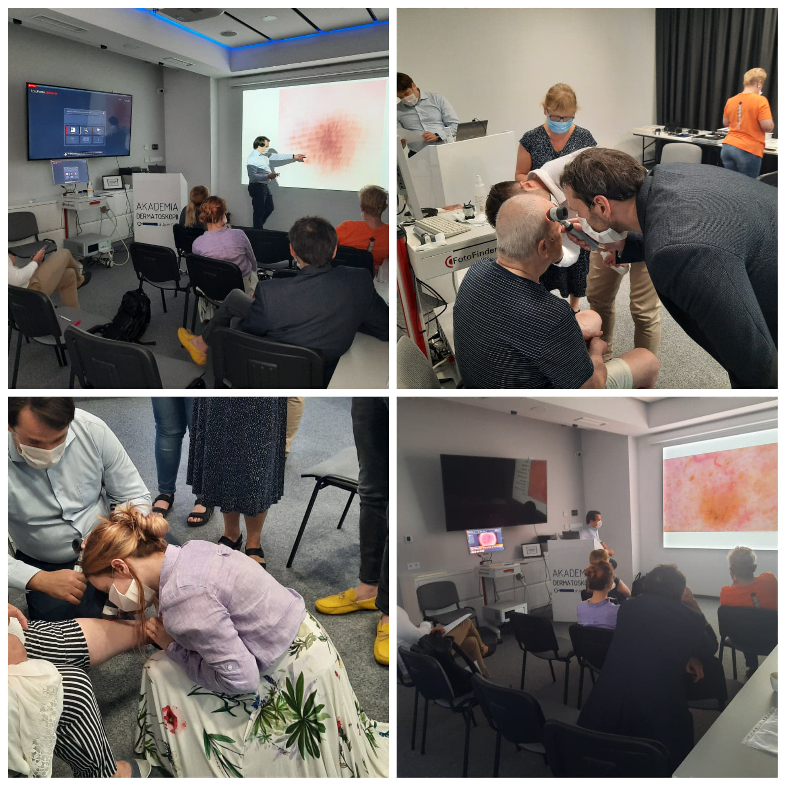

Po dłuższej przerwie, w kilkuosobowej grupie i z zachowaniem zasad bezpieczeństwa w miniony piątek i sobotę odbył się kurs dermatoskopowy na poziomie podstawowym.  
Dziękujemy lekarzom za zaangażowanie, chęć nauki i miłą atmosferę  
Jednocześnie zapraszamy na kolejne kursy!  
Zgłoszeń można dokonywać przez stronę [www.akademiadermatoskopii.pl](https://l.facebook.com/l.php?u=http%3A%2F%2Fwww.akademiadermatoskopii.pl%2F%3Ffbclid%3DIwAR2nFibW-7hbk-Ra4XblHlyKddV2gSCQxTzKs8Fw5OpIFYTTW7gLmAGTeCM&h=AT3OJoqLX0Rsf_qucZVmBwonuG4gMExFwiToVKMIq1eNBJPuvKSwUizGOuHLZLqfM7i4Ti7g0OqpLuDPo1hQyMjWSBSkAl7VbEtsteD2FzteIeDhfMP2LN3YDY7aSWpj28r21xFNVuuRp3zRsdf_OrDc8YBjHOhntJM-pT2AOVZDAwuERRnvEBwdr_Q2DwwKFzTqzg5K1Te4lSbVdbNB5D3CH4yWan2Mkn5ZApkDWoqHF1GwovcV4oiJj9pe92iCREsj0J5deDGypHOgT041NNXxmHPSUonypANXrZ-caweHIZojl0s1_4sT9S8O92ot3Kx-ezP7QUQAsaQodxWoNwtRFtyg7bf6UaQkee9wnWId-Xn71Fst44MC7gu0DN27YAesdct4K687AdyjsfMjXtqgFptstH77tKtuM2GyrpEzRKyZWTWv82YBCXay1eyIFgfxTktvuYkB8_usl2ymkr3qsZXqYf5584EiKJunqu9go-oOAGvBVIgd5TUe_Avu40ixTGeaVXaTWHiB1xxB7DH40xLofGFHq8GYWj8iFPFCpOcC-XwZF9HOM7f33Bad61RxT5bFNKvitbtkaWb86SO7hOUbWe9bzBogkvJn0bgiUnvzNqcnVH03k4-WVpb5) wypełniając zamieszczony formularz lub telefonicznie 516 516 065  
Do zobazcenia!

-   
