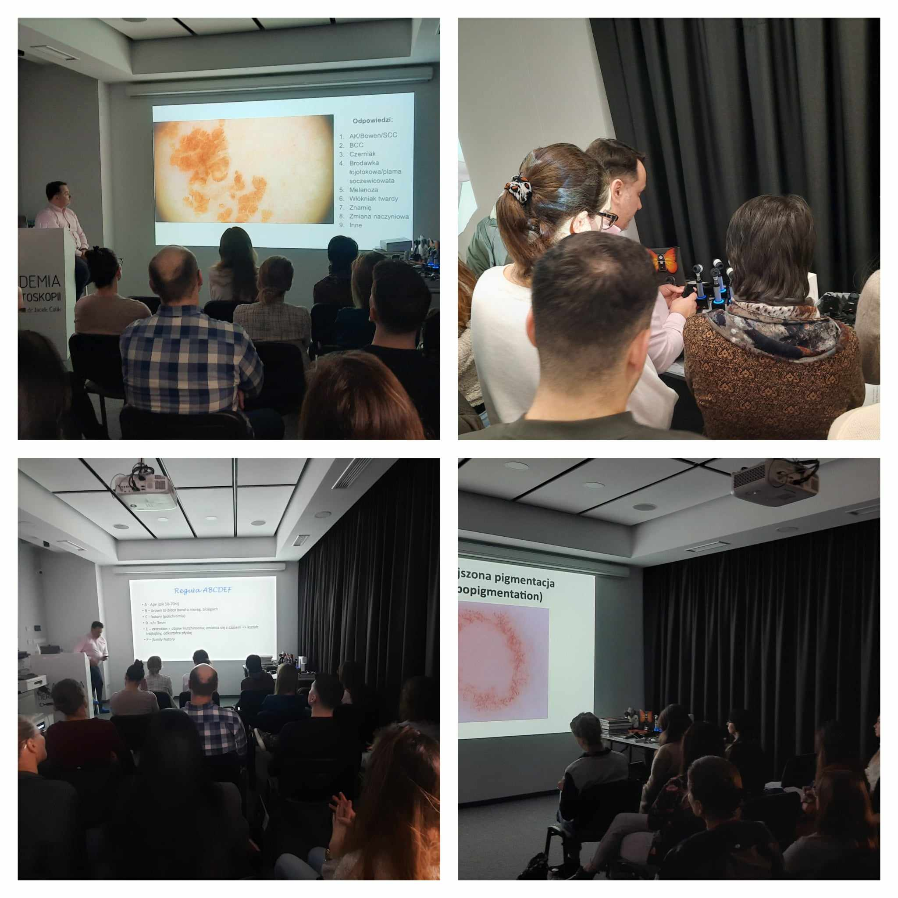

Po świąteczno-noworocznej przerwie i po feriach zimowych czas wrócić z kursami dermatoskopowymi! Za nami pierwszy z nich!  
Przed chwilą zakończył się kurs dermatoskopowy na poziomie podstawowym! Kierownikiem naukowym i prawadzącym kurs niezmiennie dr n.med. Jacek Calik!  
To były dwa dni pełne ważnych informacji, wielu obrazów dermatoskopowych i badań! Dziękujemy uczestniczącym lekarzom za chęć poszerzania swojej wiedzy i aktywne uczestnictwo!  
Kolejny kurs dermatoskopowy na poziomie podstawowym już  
23-24.02.2024!

Prowadzący: dr n.med. Jacek Calik  
Zapisy niezmiennie pod numerem telefonu 516-516-065 lub kontakt@akademiadermatoskopii.pl  
Agenda kursu dostępna na stronie: [https://akademiadermatoskopii.pl/kursy/](https://akademiadermatoskopii.pl/kursy/)  
Do zobaczenia!

